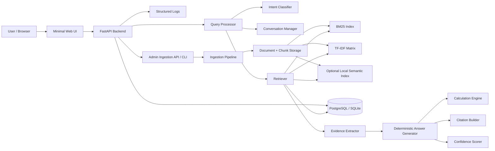
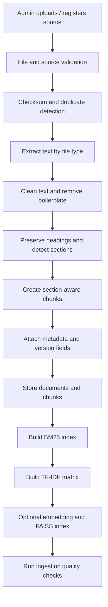
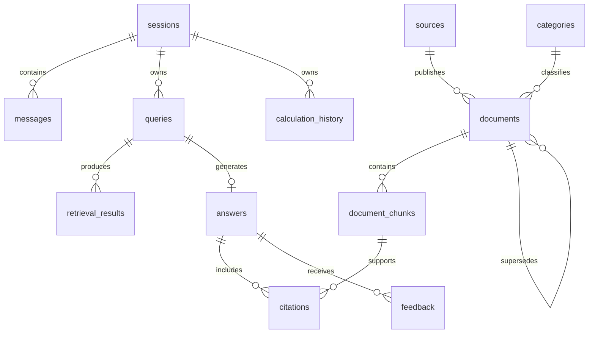
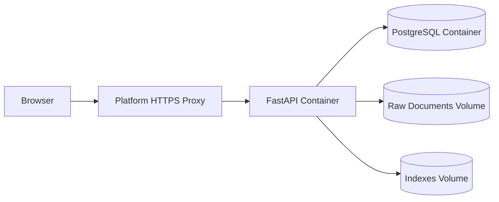

# FinTech No-LLM RAG Chatbot

## 1. Executive Summary

Build an offline-first FinTech knowledge chatbot that retrieves verified financial information from curated documents and generates only deterministic, evidence-grounded responses. It must not call or embed any generative LLM service or model.

The recommended implementation is a Python/FastAPI system using PostgreSQL (or SQLite locally), BM25 and TF-IDF retrieval, deterministic intent classification, extractive evidence selection, templates, a calculation engine, and transparent citations. BM25 requires consistent query/document tokenization, and `rank-bm25` is a lightweight in-memory implementation suitable for a student-scale corpus.

## 2. Goals

- Answer approved financial-literacy questions using a curated evidence base.
- Support banking, loans, cards, investments, insurance, taxation, personal finance, and regulation.
- Return concise deterministic answers with citations, confidence, and refusal where evidence is insufficient.
- Support document ingestion, indexing, versioning, admin operations, retrieval evaluation, and feedback.
- Provide numerical financial calculations through audited Python formulas.
- Run locally without external AI APIs or GPUs.
- Deploy as a small production-style web application.

## 3. Non-Goals

- No generative language model, local or cloud-hosted.
- No OpenAI, ChatGPT, Gemini, Claude, Llama, Mistral, Qwen, DeepSeek, or equivalent generation APIs.
- No autonomous financial advisory or personalized investment recommendation.
- No prediction of stock prices, returns, market direction, or loan approval outcomes.
- No scraping of protected, login-only, or legally restricted financial content.
- No complex microservice platform, Kubernetes cluster, or distributed search deployment in version 1.

## 4. No-LLM Architecture

### Definitions

| Term | Meaning in this project | Permitted? |
|---|---|---|
| LLM | A large neural language model trained to predict/generate natural-language token sequences, used for open-ended completion, summarization, or chat | No |
| Traditional NLP | Tokenization, sentence splitting, lemmatization, stopword handling, regex, stemming, NER, keyword matching, dictionaries | Yes |
| Embedding model | A model that maps text to numeric vectors for similarity search; it does not itself generate response text | Optional |
| Classical ML classifier | Logistic Regression, Linear SVM, Naive Bayes trained on labeled intents | Yes |
| Information retrieval | Ranking documents/chunks using BM25, TF-IDF, keyword matching, metadata filters | Yes |
| Extractive QA | Selecting sentences or spans that already exist in retrieved evidence | Yes |
| Rule-based system | Deterministic logic defined through regex, dictionaries, thresholds, routing, and policies | Yes |
| Template-based NLG | Filling predefined controlled templates with extracted facts and citations | Yes |

An embedding model, if enabled, is used only for retrieval similarity: it converts queries and document chunks into fixed vectors, ranks candidates by cosine similarity, and never produces answer text. It is not the answer generator; therefore all response text must still come from approved templates plus extractive evidence. For the first implementation, keep semantic search optional and ship pure lexical retrieval first.

### Strict enforcement

Create `app/core/no_llm_policy.py`:

```python
FORBIDDEN_PACKAGES = {
    "openai",
    "anthropic",
    "google.generativeai",
    "google.genai",
    "langchain_openai",
    "litellm",
    "ollama",
    "transformers.pipeline",
}

FORBIDDEN_ENDPOINT_PATTERNS = [
    "openai.com",
    "api.anthropic.com",
    "generativelanguage.googleapis.com",
]
```

Add CI checks that fail if:

- Forbidden imports appear in `app/`.
- Code accesses known LLM API endpoints.
- `sentence-transformers` is used for generation rather than embedding creation.
- An answer is returned without evidence, a calculation result, or a refusal template.

### Classical-only fallback

**Option A: strict classical NLP, required baseline**

```text
Query
  -> normalization and expansion
  -> BM25 retrieval
  -> TF-IDF cosine retrieval
  -> reciprocal-rank / weighted fusion
  -> deterministic reranking
  -> extractive sentence ranking
  -> response templates + citations
```

**Option B: optional hybrid retrieval**

```text
Option A
  + local embedding similarity
  + FAISS index
  -> deterministic score fusion
```

Recommendation: implement **Option A as the mandatory production baseline**. Add Option B only after passing retrieval and evidence-grounding evaluations. This keeps the project understandable, offline-first, and fully compliant with the no-LLM requirement.

## 5. System Architecture



### Core principles

- The database is the source of truth for documents, chunks, citations, sessions, evaluations, and feedback.
- The retrieval indexes are reproducible derived artifacts and must be rebuildable from active chunks.
- Every response follows one of four paths: evidence-grounded answer, deterministic calculation, clarification question, or refusal.
- All factual text must be traceable to selected evidence sentences.

## 6. Technology Stack

| Area | Recommended choice | Reason |
|---|---|---|
| Language | Python 3.12+ | Strong ecosystem for retrieval, APIs, parsing, ML, and testing |
| API | FastAPI | Typed request validation, automatic OpenAPI documentation, async support, and simple deployment |
| Validation | Pydantic v2 | Explicit schemas and robust input validation |
| ORM | SQLAlchemy 2.x | Database portability between SQLite and PostgreSQL |
| Database | PostgreSQL 16+ production; SQLite local | PostgreSQL supports concurrency, indexes, JSON fields, and durable deployment; SQLite removes setup friction locally |
| PDF parsing | PyMuPDF | Reliable page-aware extraction and page-number metadata |
| DOCX parsing | python-docx | Optional DOCX ingestion |
| HTML extraction | BeautifulSoup4 + lxml | Controlled text extraction from authorized HTML files |
| NLP | spaCy small English model + custom rules | Practical tokenization, NER, matching, and sentence segmentation |
| BM25 | `rank-bm25` | Lightweight lexical ranking with no server dependency |
| TF-IDF | scikit-learn | Mature vectorization and cosine-similarity components |
| Optional embeddings | sentence-transformers, local-only | Optional semantic retrieval only, not generation |
| Optional vector index | FAISS CPU | Fast local similarity search for fixed embeddings |
| Testing | pytest, pytest-cov, httpx | Unit, integration, and API testing |
| Migrations | Alembic | Safe database schema versioning |
| Logging | structlog or standard `logging` JSON formatter | Structured, privacy-aware observability |
| Containerization | Docker, Docker Compose | Reproducible local and cloud deployment |

### Final dependencies

```txt
# requirements.txt

fastapi==0.116.1
uvicorn[standard]==0.35.0
pydantic==2.11.7
pydantic-settings==2.10.1

SQLAlchemy==2.0.43
alembic==1.16.5
psycopg[binary]==3.2.10

PyMuPDF==1.26.4
python-docx==1.2.0
beautifulsoup4==4.13.4
lxml==6.0.1
markdown==3.8.2

spacy==3.8.7
scikit-learn==1.7.1
numpy==2.3.2
scipy==1.16.1
rank-bm25==0.2.2

python-multipart==0.0.20
httpx==0.28.1
orjson==3.11.3
structlog==25.4.0
tenacity==9.1.2

pytest==8.4.1
pytest-cov==6.2.1
pytest-asyncio==1.1.0
```

Optional semantic retrieval dependencies:

```txt
sentence-transformers==5.1.0
faiss-cpu==1.11.0.post1
```

Do not install optional semantic dependencies until the pure lexical implementation is tested and accepted.

## 7. Knowledge Base

### Approved categories

```text
banking
loans
credit_cards
investments
insurance
taxation
personal_finance
financial_regulation
financial_literacy
```

### Approved source priorities

1. Reserve Bank of India (RBI)
2. Securities and Exchange Board of India (SEBI)
3. Insurance Regulatory and Development Authority of India (IRDAI)
4. Income Tax Department of India
5. Association of Mutual Funds in India (AMFI)
6. Government of India sources
7. Official bank websites and official financial institution disclosures
8. Approved educational material authored or reviewed by an authority

### Source authority levels

| Level | Source type | Default authority score |
|---|---|---:|
| A | Regulators and government departments | 1.00 |
| B | Official statutory institutions and regulated exchange bodies | 0.90 |
| C | Official financial institution disclosures | 0.80 |
| D | Approved nonprofit / financial-literacy material | 0.65 |
| E | Unverified third-party source | Not eligible by default |

### Initial dataset

Start with 10–20 authoritative documents, yielding at least 100 chunks.

| Category | Recommended document types |
|---|---|
| Banking | RBI FAQs for NEFT, RTGS, IMPS, UPI, KYC and deposit accounts |
| Loans | RBI financial-literacy material on loan terms, interest, borrower rights |
| Credit cards | RBI card-related consumer guidance and selected official issuer terms |
| Investments | SEBI investor education, AMFI mutual-fund education, exchange educational resources |
| Insurance | IRDAI consumer education for life and health insurance |
| Taxation | Income Tax Department guides for TDS, deductions, taxable income, capital gains terminology |
| Personal finance | RBI / SEBI / AMFI financial-literacy guides |
| Regulation | Current circulars, FAQs, notifications, or publicly available official policies |

### Dataset rules

- Download only legally usable public materials.
- Store the source URL and retrieval timestamp.
- Preserve original files in `data/raw/`.
- Keep an extracted, normalized version in `data/processed/`.
- Record publication, effective, update, and supersession dates.
- Mark unverified, expired, or superseded documents inactive rather than deleting historical records.
- Do not use one bank’s fee schedule to answer generic questions about all banks.

## 8. Document Ingestion

### Pipeline



### Supported file types

| Type | Parser | Status |
|---|---|---|
| PDF | PyMuPDF | Required |
| TXT | Native Python decoding with encoding fallback | Required |
| Markdown | `markdown` / plain structural parser | Required |
| HTML | BeautifulSoup with approved allowlist | Required |
| DOCX | `python-docx` | Optional |

### Ingestion stages

1. **Discover files**
   - Admin CLI scans `data/raw/<source_name>/`.
   - Admin API accepts individual uploads or registered URLs.
   - Do not automatically crawl the web in version 1.

2. **Validate files**
   - Allow only `pdf`, `txt`, `md`, `html`, `htm`, and optionally `docx`.
   - Maximum upload size: 25 MB.
   - Validate MIME signature, not just extension.
   - Reject encrypted PDFs, executable content, archive bombs, and malformed files.
   - Calculate SHA-256 checksum to identify duplicates.

3. **Extract text**
   - PDF extraction must preserve `page_number`.
   - HTML extraction removes `script`, `style`, `nav`, `footer`, `aside`, cookie banners, and repetitive menus.
   - DOCX extraction preserves heading hierarchy where possible.

4. **Clean text**
   - Normalize Unicode and whitespace.
   - Remove repeated headers, footers, page numbers, and table-of-contents duplication.
   - Preserve headings, lists, numerical values, rates, dates, rupee symbols, and regulatory identifiers.
   - Do not lowercase stored original text; create a normalized search field separately.

5. **Detect sections**
   - Use PDF typography / markdown headings / HTML heading tags when available.
   - Fallback heading rule: a short line, title case, no terminal punctuation, surrounded by blank lines.
   - Maintain section hierarchy such as `Loans > Interest Rates > Floating Rate`.

6. **Chunk documents**
   - Use the strategy in Section 9.
   - Each chunk must belong to one document and preferably one section.

7. **Metadata enrichment**
   - Assign category through admin selection plus deterministic rules.
   - Assign authority from approved source registry.
   - Store source URL, dates, document version, document type, page ranges, and section.

8. **Indexing**
   - Index only `ACTIVE` documents and chunks.
   - Persist index versions and chunk IDs.
   - Rebuild indexes atomically, then switch the active index pointer.

### Ingestion quality checks

Reject or flag a document when:

- Extracted text is fewer than 200 meaningful characters.
- More than 40% of lines are duplicated.
- PDF page extraction is mostly empty, indicating scanned OCR-only content.
- Metadata source authority is unapproved.
- The document is expired, missing dates, or contains suspicious extraction corruption.
- A version conflict is detected without an explicit administrative decision.

## 9. Chunking

Financial documents frequently contain definitions, exceptions, eligibility conditions, rates, dates, and procedures that must not be separated from their qualifiers. Therefore use **section-aware semantic chunks**, not fixed arbitrary token counts.

### Chunking rules

1. Split at document headings first.
2. Split a long section by paragraph boundaries.
3. Preserve a sentence-level overlap only when a dependent sentence begins with pronouns, references, conditions, or exceptions.
4. Keep tables with their introductory heading and explanatory note whenever possible.
5. Do not split:
   - A definition from its defining phrase.
   - A condition from its exception.
   - A fee/rate from its effective date and applicability.
   - A numbered process from its steps.
6. Keep chunks approximately 80–220 words, with a soft target of 140 words.
7. Use 1–2 sentence overlap only when a logical dependency crosses the boundary.
8. Permit chunks shorter than 80 words for self-contained definitions, regulatory notices, tables, and FAQ answers.
9. Hard maximum: 300 words. If exceeded, split at the strongest paragraph or list boundary.

### Chunk record example

```json
{
  "document_id": "rbi-neft-faq-2026",
  "chunk_id": "rbi-neft-faq-2026-p03-s02-c01",
  "title": "NEFT Frequently Asked Questions",
  "section": "What is NEFT?",
  "category": "banking",
  "source": "Reserve Bank of India",
  "source_url": "https://www.rbi.org.in/...",
  "publication_date": "2025-05-01",
  "last_updated": "2026-01-15",
  "authority": "A",
  "document_type": "faq",
  "page_number": 3,
  "page_end": 3,
  "text": "National Electronic Funds Transfer (NEFT) is ...",
  "normalized_text": "national electronic funds transfer neft ...",
  "status": "active"
}
```

## 10. NLP Pipeline

### Pipeline stages

```text
Raw query
  -> Unicode normalization
  -> whitespace normalization
  -> spelling and abbreviation normalization
  -> financial synonym expansion
  -> tokenization
  -> protected-term handling
  -> lemmatization
  -> keyword/entity extraction
  -> intent classification
  -> query variants for retrieval
```

### Tokenization and normalization

Use spaCy for sentence segmentation, tokenization, lemmatization, rule matching, and custom entity rules.

Rules:

- Preserve numbers, decimals, `%`, `₹`, `Rs`, dates, period units, loan identifiers, and acronyms.
- Normalize `₹5 lakh`, `5 lakhs`, `Rs. 500000`, and `500,000 INR` into structured monetary representations where possible.
- Lowercase normalized search tokens but retain raw text for display.
- Do not remove finance-bearing stopwords such as `interest`, `rate`, `due`, `tax`, `fund`, `loan`, `credit`, `account`, `term`, `risk`, `claim`, `minimum`, `annual`.
- Use a custom stopword list rather than an aggressive default list.
- Apply lemmatization to normal words but preserve known acronyms and product terms.

### Financial terminology dictionary

Store in `configs/financial_terms.yaml`.

```yaml
abbreviations:
  emi:
    expansion: equated monthly instalment
    category: loans
  fd:
    expansion: fixed deposit
    category: banking
  rd:
    expansion: recurring deposit
    category: banking
  sip:
    expansion: systematic investment plan
    category: investments
  roi:
    expansion: return on investment
    category: investments
  apr:
    expansion: annual percentage rate
    category: loans
  kyc:
    expansion: know your customer
    category: banking
  upi:
    expansion: unified payments interface
    category: banking
  neft:
    expansion: national electronic funds transfer
    category: banking
  rtgs:
    expansion: real time gross settlement
    category: banking
  imps:
    expansion: immediate payment service
    category: banking
synonyms:
  home_loan: [housing loan, mortgage loan]
  interest_rate: [roi, rate of interest, borrowing rate]
  credit_score: [cibil score, credit rating]
  mutual_fund: [mf, managed fund]
  fixed_deposit: [term deposit, fd]
  prepayment: [part payment, early repayment]
```

### Query expansion

Use deterministic expansion only:

```text
Original query:
"How does FD interest work?"

Expanded retrieval query:
"how does fixed deposit fd interest rate work"

Retrieved filters:
category = banking
```

Expansion rules:

- Add acronym expansion when an exact abbreviation is found.
- Add up to two approved synonyms per domain entity.
- Add category-specific terms only if the main entity maps unambiguously.
- Do not add speculative terms.
- Do not expand common ambiguous terms such as `interest`, `fund`, `account`, or `charge` without supporting entities.
- Maintain both raw query and expanded query; retrieval may use both.

## 11. Intent Classification

### Supported intents

```text
definition
explanation
comparison
calculation
procedure
eligibility
fees
interest
risk
regulation
transaction
investment
loan
credit_card
insurance
tax
general_finance
unsupported
clarification_needed
```

### Recommended approach

Use a **hybrid deterministic classifier**:

1. High-precision keyword, pattern, and regex rules.
2. TF-IDF + Logistic Regression for unresolved or ambiguous cases.
3. Confidence calibration and abstention threshold.
4. Final policy override for safety, calculations, and unsupported requests.

This is more reliable than pure rules for phrasing variation and more explainable than a black-box approach. It also remains deterministic at inference time.

### Routing rules

```python
if matches_calculation_pattern(query) and has_required_parameters(query):
    intent = "calculation"
elif matches_personalized_advice_pattern(query):
    intent = "unsupported"
elif matches_definition_pattern(query):
    intent = "definition"
elif classifier_confidence < 0.55:
    intent = "clarification_needed"
else:
    intent = classifier_prediction
```

### Rule examples

```yaml
definition:
  phrases:
    - "what is"
    - "meaning of"
    - "define"
    - "what does .* mean"
comparison:
  patterns:
    - "\\b(.+)\\s+(vs|versus|difference between|compare)\\s+(.+)\\b"
calculation:
  patterns:
    - "\\bcalculate\\b"
    - "\\bcompute\\b"
    - "\\bemi\\b.*\\b(loan|rate|interest|year|month)\\b"
    - "\\bcompound interest\\b"
procedure:
  phrases:
    - "how to"
    - "steps to"
    - "how do i"
fees:
  phrases:
    - "fee"
    - "charge"
    - "penalty"
    - "annual fee"
unsupported:
  patterns:
    - "\\bwhich stock should i buy\\b"
    - "\\binvest all my money\\b"
    - "\\bguaranteed return\\b"
    - "\\bwill .* stock .* rise\\b"
```

### Training data

Create `data/evaluation/intent_train.jsonl` with at least:

- 80–120 labeled examples per high-volume intent.
- 40–60 examples for lower-volume intents.
- At least 100 adversarial or ambiguous examples.
- Indian financial terminology and spelling variants.
- Separate train, validation, and test splits: 70/15/15.

Example:

```json
{
  "text": "How is EMI calculated for a home loan?",
  "intent": "calculation",
  "entities": ["emi", "home_loan"],
  "category": "loans"
}
```

### Evaluation

Measure:

- Accuracy.
- Macro F1 score.
- Per-intent precision and recall.
- Confusion matrix.
- Abstention accuracy.
- Safety false-negative rate for risky personalized advice.

Target:

```text
Macro F1 >= 0.85
Calculation precision >= 0.95
Unsupported-advice recall >= 0.95
Clarification-needed precision >= 0.80
```

## 12. Query Processing

### Query processor contract

```python
class ProcessedQuery(BaseModel):
    raw_query: str
    normalized_query: str
    expanded_query: str
    tokens: list[str]
    lemmas: list[str]
    keywords: list[str]
    entities: list[dict]
    inferred_category: str | None
    intent: str
    intent_confidence: float
    requires_calculation: bool
    requires_clarification: bool
    safety_flags: list[str]
    query_filters: dict
```

### Query-processing procedure

1. Validate length: 2–1,000 characters.
2. Normalize Unicode, whitespace, currency notation, and punctuation.
3. Resolve abbreviations and synonym expansions.
4. Extract entities using rules:
   - Product: FD, SIP, UPI, mutual fund, home loan.
   - Currency and amount: ₹5 lakh, INR 500000.
   - Percentage: 10%, 10.5 percent.
   - Term: 5 years, 60 months.
   - Dates: FY 2026–27, 1 April 2026.
5. Classify intent.
6. Detect high-risk personal advice request.
7. Resolve follow-up references using conversation state.
8. Create lexical and expanded retrieval variants.
9. Apply category, authority, status, and date filters.
10. Route to calculation, retrieval, clarification, or refusal.

## 13. Retrieval

### Candidate retrieval

Retrieve top candidates independently from:

- BM25 over normalized chunk text.
- TF-IDF cosine similarity over normalized chunk text.
- Optional semantic cosine similarity over local embeddings.
- Exact-title / acronym match boost.
- Metadata-filtered subset.

Use the same normalization and tokenization policy for indexing and querying.

### BM25 formula

For query \(Q\) and document chunk \(D\):

\[
BM25(Q,D)=\sum_{q_i \in Q} IDF(q_i)\cdot \frac{f(q_i,D)(k_1+1)}{f(q_i,D)+k_1\left(1-b+b\cdot \frac{|D|}{avgdl}\right)}
\]

Where:

- \(f(q_i,D)\): frequency of term \(q_i\) in chunk \(D\).
- \(|D|\): token length of chunk \(D\).
- \(avgdl\): average chunk length in the corpus.
- \(k_1\): term-frequency saturation parameter; start at 1.2.
- \(b\): document-length normalization; start at 0.75.
- \(IDF(q_i)\): inverse document frequency.

### TF-IDF cosine similarity

\[
TFIDF(t,d)=TF(t,d)\cdot IDF(t)
\]

\[
Cosine(Q,D)=\frac{\vec{Q}\cdot\vec{D}}{\|\vec{Q}\|\|\vec{D}\|}
\]

Use:

```python
TfidfVectorizer(
    ngram_range=(1, 2),
    min_df=1,
    max_df=0.98,
    sublinear_tf=True,
    lowercase=False,
    tokenizer=custom_tokenizer
)
```

### Optional semantic similarity

\[
Semantic(Q,D)=\frac{\vec{e}_Q\cdot\vec{e}_D}{\|\vec{e}_Q\|\|\vec{e}_D\|}
\]

Only use a locally stored, non-generative embedding encoder. Do not send text to external embedding APIs.

### Metadata filtering

Apply before reranking:

```text
status = ACTIVE
authority_score >= configured minimum
category in inferred categories, if high-confidence category exists
effective_date <= current date, if present
superseded_by IS NULL, unless historical mode enabled
```

### Candidate counts

```text
BM25 candidates: 30
TF-IDF candidates: 30
Optional semantic candidates: 30
Union candidate cap before reranking: 60
Final evidence chunks: 3–5
Final cited sources: 1–3
```

## 14. Hybrid Ranking

### Score normalization

Raw BM25 values vary by corpus, so normalize scores per query with min-max normalization:

\[
Norm(s_i)=
\begin{cases}
0.0 & \text{if } max(s)=min(s)\\
\frac{s_i-min(s)}{max(s)-min(s)} & \text{otherwise}
\end{cases}
\]

### Metadata scores

**Authority**

\[
Authority(D)=
\begin{cases}
1.00 & A\\
0.90 & B\\
0.80 & C\\
0.65 & D
\end{cases}
\]

**Recency**

Use an exponential decay only when a source type requires freshness, such as fee schedules, tax rules, regulatory circulars, and product-specific policies:

\[
Recency(D)=e^{-\lambda \cdot age\_years}
\]

Use \(\lambda = 0.35\) as an initial tuning value. For evergreen definitions, set recency weight to zero rather than penalizing older authoritative educational material.

**Metadata relevance**

\[
Metadata(D)=0.60\cdot CategoryMatch + 0.25\cdot DocumentTypeMatch + 0.15\cdot ExactEntityMatch
\]

Each component is 0 or 1, except category match can be 0.5 for a related category.

### Primary hybrid formula

For the baseline classical system:

\[
Hybrid(D)=0.48\cdot BM25_n+
0.27\cdot TFIDF_n+
0.10\cdot Metadata(D)+
0.10\cdot Authority(D)+
0.05\cdot Recency(D)
\]

For the optional semantic system:

\[
HybridSemantic(D)=0.38\cdot BM25_n+
0.22\cdot TFIDF_n+
0.18\cdot Semantic_n+
0.08\cdot Metadata(D)+
0.09\cdot Authority(D)+
0.05\cdot Recency(D)
\]

The larger BM25 weight reflects the importance of exact financial terms, abbreviations, legal wording, rates, and named payment systems.

### Deterministic reranking

Apply these explicit rules after hybrid scoring:

1. Boost 0.10 if the chunk heading directly matches the requested concept.
2. Boost 0.08 if all core entities appear in the chunk.
3. Penalize 0.20 if source effective date has expired.
4. Penalize 0.15 if answer type is generic but document is product-specific without product match.
5. Penalize 0.25 for a superseded chunk.
6. Exclude inactive chunks.
7. Prefer newer source only when the source types and subject matter are comparable.
8. Preserve top chunks from distinct documents when scores are close, to enable corroboration.

## 15. Evidence Extraction

### Objective

Select exact sentences or list items that support the planned answer. Do not paraphrase unsupported information.

### Sentence scoring

Split selected chunks into sentences. Score each candidate:

\[
SentenceScore(S)=
0.45\cdot QueryOverlap+
0.20\cdot EntityCoverage+
0.15\cdot ChunkHybrid+
0.10\cdot SectionMatch+
0.10\cdot SourceAuthority
\]

Where:

- `QueryOverlap`: weighted token overlap after normalization.
- `EntityCoverage`: fraction of extracted query entities contained in sentence.
- `ChunkHybrid`: normalized parent-chunk hybrid score.
- `SectionMatch`: 1.0 if heading matches query concept, otherwise 0.0–0.5.
- `SourceAuthority`: authority score for parent source.

### Selection logic

- Select 1–3 sentences for definitions and explanations.
- Select 2–4 evidence spans for comparisons or procedures.
- Ensure no selected sentence contains unresolved pronouns without its antecedent.
- Add a preceding sentence if it provides required context.
- Deduplicate near-identical sentences using token Jaccard similarity.
- Include source and page/section metadata for every selected sentence.
- Reject evidence if all selected sentences fall below sentence threshold.

### Evidence contract

```python
class EvidenceSpan(BaseModel):
    chunk_id: str
    document_id: str
    sentence_text: str
    sentence_index: int
    title: str
    section: str | None
    page_number: int | None
    source_url: str | None
    authority: str
    publication_date: date | None
    last_updated: date | None
    sentence_score: float
```

## 16. Deterministic Answer Generation

### Response modes

| Mode | Trigger | Output method |
|---|---|---|
| Definition | “What is X?” | Title/term template + extracted definition sentence |
| Explanation | “How does X work?” | Extracted supporting sentences + explanatory template |
| Comparison | “X vs Y” | Structured comparison table from evidence |
| Procedure | “How to…” | Ordered extracted steps when available |
| Fees / rates | Explicit query and authoritative current source | Value plus applicability and effective-date context |
| Calculation | Complete validated numeric inputs | Python calculation output + formula + disclaimer |
| Clarification | Ambiguous query or missing required calculation field | Controlled clarification question |
| Safety refusal | Personalized/advisory, prediction, illegal, unsupported request | Safety template |
| Insufficient evidence | Retrieval below confidence threshold | Insufficient-evidence template |

### Answer construction rules

1. Never synthesize facts not found in evidence.
2. Every factual clause must map to a selected evidence span.
3. Use only:
   - Controlled template text.
   - Extracted sentence text.
   - Exact normalized entity names.
   - Deterministic calculation output.
   - Metadata such as source title, page, and date.
4. Do not modify numerical values found in evidence.
5. Do not infer applicability across institutions.
6. When evidence has a product-specific context, name the product/source explicitly.
7. When a source provides an old date, display it.
8. Do not answer if selected evidence does not meet support requirements.

### Templates

```python
DEFINITION_TEMPLATE = """{term} means:

{definition_sentence}

Source: [{citation_id}]"""
```

```python
EXPLANATION_TEMPLATE = """{topic}

{support_sentence_1}

{support_sentence_2}

This is educational information based on the cited source(s)."""
```

```python
INSUFFICIENT_EVIDENCE_TEMPLATE = """I couldn't find sufficient information in the verified financial knowledge base to answer this question.

Try using a more specific term, or ask about an approved financial-literacy topic."""
```

```python
PERSONALIZED_ADVICE_TEMPLATE = """I can provide general educational information, but I cannot recommend a specific investment, predict returns, or advise you to invest all of your money in a particular product.

Consider your objectives, risk tolerance, time horizon, liquidity needs, and consult a SEBI-registered investment adviser or other qualified professional where appropriate."""
```

```python
CLARIFICATION_TEMPLATE = """I need one more detail to answer accurately: {missing_field}.

For example: {example}"""
```

### Example: EMI definition

```text
Question: What is EMI?

Answer:
EMI means Equated Monthly Instalment.

[Extracted evidence sentence defining EMI.]

Sources:
[1] Source title — section/page — URL
```

The first sentence is a controlled expansion from the terminology dictionary. The second sentence must be extracted from source evidence.

### Comparison behavior

For `FD vs mutual fund`, do not create a generic free-text comparison. Build a fixed comparison schema, populate only fields supported by evidence, and mark missing fields as “Not established by the retrieved sources.”

```json
{
  "comparison_fields": [
    "what_it_is",
    "return_characteristics",
    "risk",
    "liquidity",
    "tax_treatment",
    "suitability_note"
  ]
}
```

## 17. Financial Calculation Engine

### Supported calculations

- Loan EMI.
- Loan amortization schedule.
- Simple interest.
- Compound interest.
- CAGR.
- SIP future value.
- Percentage change.
- Basic loan outstanding balance.
- Optional tax estimators only for explicitly modeled tax years and published rules.

### Calculation safety policy

- Clearly identify all assumptions.
- Never use live market prices, forecast returns, or unverified rates.
- Only calculate from user-supplied numbers or explicitly selected verified rates.
- Treat outputs as illustrations unless the source and all conditions are verified.
- Do not silently default missing rates, tenure, compounding frequency, or payment timing.
- Do not calculate tax liability without the relevant tax year, regime, and required inputs.

### Loan EMI

\[
EMI = P \times r \times \frac{(1+r)^n}{(1+r)^n - 1}
\]

Where:

- \(P\): principal amount.
- \(r\): monthly interest rate as decimal, annual rate divided by 12 and 100.
- \(n\): total monthly installments.

```python
def calculate_emi(principal: Decimal, annual_rate_pct: Decimal, tenure_months: int) -> Decimal:
    if principal <= 0:
        raise ValueError("principal must be greater than zero")
    if tenure_months <= 0:
        raise ValueError("tenure_months must be greater than zero")
    if annual_rate_pct < 0:
        raise ValueError("annual_rate_pct cannot be negative")

    if annual_rate_pct == 0:
        return principal / Decimal(tenure_months)

    monthly_rate = annual_rate_pct / Decimal("1200")
    factor = (Decimal("1") + monthly_rate) ** tenure_months
    return principal * monthly_rate * factor / (factor - Decimal("1"))
```

### Simple interest

\[
SI = \frac{P \times R \times T}{100}
\]

Where \(R\) is annual percentage rate and \(T\) is time in years.

### Compound interest

\[
A=P\left(1+\frac{r}{n}\right)^{nt}
\]

\[
CI=A-P
\]

Where:

- \(P\): principal.
- \(r\): annual decimal rate.
- \(n\): compounding events per year.
- \(t\): duration in years.

### CAGR

\[
CAGR=\left(\frac{EndingValue}{BeginningValue}\right)^{\frac{1}{years}}-1
\]

Reject beginning values less than or equal to zero and periods less than or equal to zero.

### SIP future value

For SIP contributions paid at the end of each period:

\[
FV = PMT \times \frac{(1+i)^n-1}{i}
\]

For contributions paid at the beginning of each period:

\[
FV_{due}=PMT \times \frac{(1+i)^n-1}{i} \times (1+i)
\]

Where:

- \(PMT\): recurring contribution.
- \(i\): periodic decimal rate.
- \(n\): total payments.

Expose `payment_timing` explicitly as `end_of_period` or `beginning_of_period`; do not assume.

### Numerical implementation standards

- Use Python `Decimal`, not binary `float`.
- Quantize display currency to 2 decimal places using `ROUND_HALF_UP`.
- Store currency as ISO 4217 code; default `INR` only when the user explicitly uses Indian rupee notation or chooses it.
- Store raw inputs, normalized inputs, formula version, and output.
- Reject negative money and percentage values unless a calculation explicitly permits them.
- Handle zero-interest EMI separately.
- Require annual vs monthly rate distinction explicitly.
- Show inputs, assumptions, formula name, result, and optional amortization table.
- Unit test all formulas against independently verified expected values.

### Calculation response

```json
{
  "calculation_type": "emi",
  "inputs": {
    "principal": "500000.00",
    "annual_interest_rate_pct": "10.00",
    "tenure_months": 60,
    "currency": "INR"
  },
  "formula": "EMI = P × r × (1+r)^n / ((1+r)^n - 1)",
  "result": {
    "monthly_emi": "10623.52",
    "total_payment": "637411.20",
    "total_interest": "137411.20"
  },
  "assumptions": [
    "Interest rate is constant for the full tenure.",
    "Payments are monthly.",
    "Processing fees, insurance, taxes, and prepayments are excluded."
  ]
}
```

## 18. Citations

### Citation policy

Every factual answer must include at least one source citation. Calculations must cite the formula version or state that results are computed from user inputs, but should not fabricate external sources.

### Citation structure

```json
{
  "citation_id": 1,
  "document_id": "rbi-neft-faq-2026",
  "chunk_id": "rbi-neft-faq-2026-p03-s02-c01",
  "source_title": "NEFT Frequently Asked Questions",
  "source_name": "Reserve Bank of India",
  "authority_level": "A",
  "section": "What is NEFT?",
  "page_number": 3,
  "source_url": "https://www.rbi.org.in/...",
  "publication_date": "2025-05-01",
  "last_updated": "2026-01-15",
  "effective_date": "2026-01-15",
  "excerpt": "Short extract used as answer evidence."
}
```

### UI display format

```text
Sources
[1] Reserve Bank of India — NEFT Frequently Asked Questions
    Section: What is NEFT? | Page: 3 | Updated: 2026-01-15
    URL: https://...
```

### Citation constraints

- A citation must reference the exact document and chunk used.
- Do not cite a document merely because it ranked highly.
- Do not cite an inactive or superseded source unless explicitly answering historical questions.
- If the response includes multiple claims from multiple sources, attach citations at sentence or table-row level.
- Never fabricate page number, title, authority, date, or URL.

## 19. Confidence Scoring

### Score components

\[
Confidence =
0.32R+
0.18E+
0.16A+
0.14I+
0.12C+
0.08(1-X)
\]

Where:

- \(R\): normalized top retrieval score.
- \(E\): evidence-support score.
- \(A\): source-authority score.
- \(I\): intent-classifier confidence.
- \(C\): corroboration score from independent supporting sources.
- \(X\): contradiction risk score.

All components are normalized to 0–1.

### Definitions

**Retrieval relevance \(R\)**

```text
0.70 × top_chunk_hybrid_score
+ 0.30 × mean(top_3_chunk_hybrid_scores)
```

**Evidence support \(E\)**

```text
0.60 × mean(selected_sentence_scores)
+ 0.40 × answer_evidence_overlap
```

**Authority \(A\)**

```text
maximum authority among cited sources,
plus 0.05 if two independent authoritative sources corroborate,
capped at 1.00
```

**Intent confidence \(I\)**

- Rule match: 0.95 for unambiguous high-precision patterns.
- ML classifier: calibrated probability.
- Ambiguous pattern: below 0.65, request clarification.

**Corroboration \(C\)**

```text
0.0: one supporting source
0.5: two sources, same authority band
1.0: two or more independent authoritative sources agree
```

**Contradiction risk \(X\)**

```text
0.0: no conflict detected
0.5: scope/date mismatch requiring qualification
1.0: conflicting factual values from comparable authoritative sources
```

### Thresholds

| Label | Score | Required conditions | Behavior |
|---|---:|---|---|
| High | >= 0.80 | Strong evidence, authority >= B, no meaningful conflict | Answer normally |
| Medium | 0.65–0.79 | Good evidence but limited corroboration or lower ranking | Answer with cautious educational wording |
| Low | 0.45–0.64 | Partial evidence or ambiguity | Ask clarification or give limited, explicitly scoped response |
| Unsupported | < 0.45 | Weak retrieval, insufficient evidence, or unresolved conflict | Refuse using insufficient-evidence template |

Thresholds are initial calibration points, not permanent constants. Tune them using the labeled evaluation set to maximize supported-answer precision while avoiding unsafe confident answers.

## 20. Hallucination Prevention

Even without an LLM, unsupported composition can still create errors. Apply these safeguards:

1. **Minimum retrieval threshold**
   - Do not answer factually if top hybrid score is below the calibrated threshold.

2. **Minimum evidence threshold**
   - At least one evidence sentence must exceed `MIN_SENTENCE_SCORE`.
   - Require two independent evidence spans for multi-claim answers.

3. **Answer-evidence overlap**
   - All non-template content must come directly from selected evidence spans, normalized entity names, or calculation output.
   - Verify content tokens in generated answer appear in the evidence unless on the controlled-template allowlist.

4. **Source authority validation**
   - Require source authority A–D.
   - Require A–C for regulation, fees, current rates, tax, and policy claims.

5. **Date relevance**
   - For time-sensitive content, require valid effective or update date.
   - Show date and source scope in the answer.

6. **Unsupported-question detection**
   - Detect prediction, personalized advice, confidential account questions, illegal activity, and out-of-domain queries.
   - Route to a refusal or safe educational response.

7. **Conflict detection**
   - Do not choose silently between conflicting current authoritative sources.
   - Explain the scope/date distinction or refuse until reviewed.

8. **No fallback free-text generation**
   - No “best effort” prose.
   - No generic completion fallback.
   - No default explanation if evidence is absent.

## 21. Conversation Management

### Session state

```python
class ConversationState(BaseModel):
    session_id: UUID
    previous_intent: str | None
    previous_category: str | None
    previous_entities: list[str]
    previous_document_ids: list[str]
    previous_chunk_ids: list[str]
    previous_answer_mode: str | None
    previous_calculation_type: str | None
    pending_clarification_field: str | None
    updated_at: datetime
```

### Follow-up resolution rules

Resolve references deterministically.

```text
Reference terms:
it, this, that, they, them, those, the same, its, their
```

### Resolution algorithm

1. Detect whether the new query contains a reference term.
2. Check the previous user message and bot response in the same session.
3. Select prior entities ranked by:
   - Mention in latest user query.
   - Mention in prior bot answer title.
   - Entity category match with current intent.
   - Mention in prior retrieved evidence headings.
4. Resolve only when exactly one entity has a sufficiently higher deterministic score.
5. If resolution is ambiguous, ask a clarification question.
6. Construct rewritten retrieval query while preserving original query.

Example:

```text
Turn 1:
User: What is an EMI?
Resolved entity: equated monthly instalment
Intent: definition

Turn 2:
User: How is it calculated?
Reference: it
Candidate entity: equated monthly instalment
Rewritten query: How is equated monthly instalment calculated?
Intent: calculation
```

### Concrete resolution scoring

\[
ReferenceScore(entity)=
0.40\cdot LastTurnMention+
0.25\cdot PriorAnswerTopic+
0.20\cdot CategoryCompatibility+
0.15\cdot EvidenceHeadingMatch
\]

Resolve when:

```text
best score >= 0.70
and
best score - second_best score >= 0.20
```

Otherwise:

```text
Do you mean EMI, or another financial topic?
```

### Session retention

- Store only necessary conversation content.
- Default retention: 30 days in development/demo configuration.
- Permit user session deletion.
- Do not treat conversational context as financial profile data.
- Do not retain calculation inputs beyond configured retention without explicit disclosure.

## 22. Database Schema

### Database recommendation

Use PostgreSQL for deployed environments. Use SQLite for local development and classroom demonstrations.

| Option | Use case | Benefits | Limits |
|---|---|---|---|
| SQLite | Local development, demo, single user | Zero setup, portable, easy backups | Limited concurrent writes and operational controls |
| PostgreSQL | Deployment, multi-user use, durable admin workflow | Concurrency, indexing, JSON support, migrations, production tooling | Requires database service |
| FAISS | Optional local vector retrieval | Fast CPU vector similarity, no server | Metadata filtering remains in application/database |
| pgvector | Future PostgreSQL vector retrieval | One database for vector + metadata | Unnecessary for baseline corpus |
| Chroma | Prototyping vectors | Easy setup | Adds another storage abstraction without need |
| Elasticsearch/OpenSearch | Large search corpus | Mature full-text search and filtering | Operationally too heavy for version 1 |

Do not add a vector database merely because the system is called RAG. BM25 and TF-IDF are sufficient for the mandatory baseline.

### Entity relationship diagram



### `sources`

| Column | Type | Constraints | Purpose |
|---|---|---|---|
| id | UUID | PK | Source identity |
| name | VARCHAR(255) | Unique, not null | Publisher/authority name |
| base_url | TEXT | Nullable | Official base URL |
| authority_level | CHAR(1) | A–D, not null | Trust tier |
| authority_score | NUMERIC(3,2) | 0–1, not null | Ranking score |
| source_type | VARCHAR(50) | Not null | regulator, bank, government, etc. |
| active | BOOLEAN | Default true | Source eligibility |
| created_at | TIMESTAMPTZ | Not null | Audit |
| updated_at | TIMESTAMPTZ | Not null | Audit |

Indexes:

```sql
CREATE INDEX ix_sources_active_authority ON sources(active, authority_score DESC);
```

### `categories`

| Column | Type | Constraints | Purpose |
|---|---|---|---|
| id | SMALLSERIAL | PK | Category ID |
| slug | VARCHAR(64) | Unique, not null | Stable machine name |
| display_name | VARCHAR(100) | Not null | UI label |
| description | TEXT | Nullable | Definition |
| active | BOOLEAN | Default true | Category status |

### `documents`

| Column | Type | Constraints | Purpose |
|---|---|---|---|
| id | UUID | PK | Document ID |
| source_id | UUID | FK `sources.id`, not null | Publisher |
| category_id | SMALLINT | FK `categories.id` | Main category |
| title | VARCHAR(500) | Not null | Document title |
| document_type | VARCHAR(50) | Not null | faq, circular, guide, policy |
| source_url | TEXT | Unique nullable | Original URL |
| local_path | TEXT | Not null | Controlled local storage path |
| content_hash | CHAR(64) | Unique, not null | SHA-256 |
| language | VARCHAR(10) | Default `en` | Language |
| publication_date | DATE | Nullable | Published date |
| effective_date | DATE | Nullable | Effective date |
| last_updated | DATE | Nullable | Update date |
| version_label | VARCHAR(100) | Nullable | Source version |
| status | VARCHAR(20) | Not null | draft, active, inactive, superseded |
| superseded_by | UUID | FK `documents.id`, nullable | Newer document |
| extracted_text | TEXT | Nullable | Audit / preview |
| extraction_quality | NUMERIC(4,3) | Nullable | Quality score |
| created_at | TIMESTAMPTZ | Not null | Audit |
| updated_at | TIMESTAMPTZ | Not null | Audit |

Constraints:

```sql
CHECK (status IN ('draft', 'active', 'inactive', 'superseded', 'failed'));
CHECK (publication_date IS NULL OR effective_date IS NULL OR effective_date >= publication_date);
```

Indexes:

```sql
CREATE INDEX ix_documents_status_category ON documents(status, category_id);
CREATE INDEX ix_documents_source_date ON documents(source_id, last_updated DESC);
CREATE INDEX ix_documents_superseded_by ON documents(superseded_by);
```

### `document_chunks`

| Column | Type | Constraints | Purpose |
|---|---|---|---|
| id | UUID | PK | Chunk ID |
| document_id | UUID | FK `documents.id`, not null | Parent document |
| chunk_sequence | INTEGER | Not null | Position in document |
| title | VARCHAR(500) | Nullable | Document title snapshot |
| section | VARCHAR(500) | Nullable | Heading/section |
| page_start | INTEGER | Nullable | First source page |
| page_end | INTEGER | Nullable | Last source page |
| raw_text | TEXT | Not null | Display / extractive evidence |
| normalized_text | TEXT | Not null | Retrieval field |
| token_count | INTEGER | Not null | Retrieval diagnostics |
| metadata_json | JSONB | Default `{}` | Extra structural metadata |
| active | BOOLEAN | Default true | Index eligibility |
| created_at | TIMESTAMPTZ | Not null | Audit |

Constraints:

```sql
UNIQUE(document_id, chunk_sequence);
CHECK (token_count > 0);
CHECK (page_end IS NULL OR page_start IS NULL OR page_end >= page_start);
```

Indexes:

```sql
CREATE INDEX ix_chunks_document_sequence ON document_chunks(document_id, chunk_sequence);
CREATE INDEX ix_chunks_active ON document_chunks(active) WHERE active = true;
CREATE INDEX ix_chunks_section ON document_chunks(section);
```

### `index_versions`

| Column | Type | Constraints | Purpose |
|---|---|---|---|
| id | UUID | PK | Index build ID |
| index_type | VARCHAR(30) | Not null | bm25, tfidf, faiss |
| artifact_path | TEXT | Not null | Local artifact |
| corpus_hash | CHAR(64) | Not null | Reproducibility |
| chunk_count | INTEGER | Not null | Build metadata |
| parameters_json | JSONB | Not null | Index parameters |
| is_active | BOOLEAN | Default false | Active pointer |
| created_at | TIMESTAMPTZ | Not null | Audit |

### `sessions`

| Column | Type | Constraints | Purpose |
|---|---|---|---|
| id | UUID | PK | Session ID |
| state_json | JSONB | Not null | Conversation state |
| created_at | TIMESTAMPTZ | Not null | Audit |
| updated_at | TIMESTAMPTZ | Not null | Audit |
| expires_at | TIMESTAMPTZ | Nullable | Retention policy |

### `messages`

| Column | Type | Constraints | Purpose |
|---|---|---|---|
| id | UUID | PK | Message ID |
| session_id | UUID | FK `sessions.id`, not null | Parent session |
| role | VARCHAR(10) | user / assistant / system | Sender |
| content | TEXT | Not null | Message content |
| message_metadata | JSONB | Default `{}` | Intent, response mode |
| created_at | TIMESTAMPTZ | Not null | Audit |

### `queries`

| Column | Type | Constraints | Purpose |
|---|---|---|---|
| id | UUID | PK | Query ID |
| session_id | UUID | FK `sessions.id` | Session |
| raw_query | TEXT | Not null | Original query |
| normalized_query | TEXT | Not null | Search query |
| expanded_query | TEXT | Nullable | Expanded search query |
| intent | VARCHAR(50) | Not null | Final intent |
| intent_confidence | NUMERIC(4,3) | Not null | Intent confidence |
| category | VARCHAR(64) | Nullable | Inferred category |
| safety_flags | JSONB | Default `[]` | Safety outcome |
| created_at | TIMESTAMPTZ | Not null | Audit |

### `retrieval_results`

| Column | Type | Constraints | Purpose |
|---|---|---|---|
| id | UUID | PK | Result ID |
| query_id | UUID | FK `queries.id`, not null | Query |
| chunk_id | UUID | FK `document_chunks.id`, not null | Candidate chunk |
| rank | SMALLINT | Not null | Result rank |
| bm25_score | NUMERIC(8,6) | Nullable | Raw/normalized score |
| tfidf_score | NUMERIC(8,6) | Nullable | Score |
| semantic_score | NUMERIC(8,6) | Nullable | Optional score |
| metadata_score | NUMERIC(8,6) | Not null | Score |
| hybrid_score | NUMERIC(8,6) | Not null | Final rank score |
| selected_as_evidence | BOOLEAN | Default false | Evidence flag |
| created_at | TIMESTAMPTZ | Not null | Audit |

Constraint:

```sql
UNIQUE(query_id, chunk_id);
```

### `answers`

| Column | Type | Constraints | Purpose |
|---|---|---|---|
| id | UUID | PK | Answer ID |
| query_id | UUID | FK `queries.id`, unique | Answered query |
| response_mode | VARCHAR(30) | Not null | definition, calculation, refusal |
| answer_text | TEXT | Not null | User-visible response |
| confidence_score | NUMERIC(4,3) | Not null | Overall confidence |
| confidence_label | VARCHAR(20) | Not null | high, medium, low, unsupported |
| evidence_support_score | NUMERIC(4,3) | Nullable | Audit |
| contradiction_score | NUMERIC(4,3) | Nullable | Audit |
| calculation_json | JSONB | Nullable | Calculation output |
| created_at | TIMESTAMPTZ | Not null | Audit |

### `citations`

| Column | Type | Constraints | Purpose |
|---|---|---|---|
| id | UUID | PK | Citation ID |
| answer_id | UUID | FK `answers.id`, not null | Parent answer |
| chunk_id | UUID | FK `document_chunks.id`, not null | Evidence chunk |
| citation_order | SMALLINT | Not null | Display order |
| excerpt | TEXT | Not null | Evidence excerpt |
| sentence_index | SMALLINT | Nullable | Source position |
| created_at | TIMESTAMPTZ | Not null | Audit |

Constraint:

```sql
UNIQUE(answer_id, citation_order);
```

### `feedback`

| Column | Type | Constraints | Purpose |
|---|---|---|---|
| id | UUID | PK | Feedback ID |
| answer_id | UUID | FK `answers.id`, not null | Answer |
| rating | SMALLINT | 1–5 nullable | Rating |
| feedback_type | VARCHAR(50) | Nullable | incorrect, incomplete, helpful |
| comment | TEXT | Nullable | User feedback |
| created_at | TIMESTAMPTZ | Not null | Audit |

### `calculation_history`

| Column | Type | Constraints | Purpose |
|---|---|---|---|
| id | UUID | PK | Record ID |
| session_id | UUID | FK `sessions.id` | Session |
| calculation_type | VARCHAR(50) | Not null | emi, sip, cagr |
| inputs_json | JSONB | Not null | Validated inputs |
| outputs_json | JSONB | Not null | Results |
| formula_version | VARCHAR(30) | Not null | Auditability |
| created_at | TIMESTAMPTZ | Not null | Audit |

## 23. Backend API

### API standards

- Base path: `/api/v1`.
- JSON responses use `snake_case`.
- Use UUID identifiers.
- Return `request_id` in every response.
- Validate all request data using Pydantic.
- Use RFC-style error payloads.
- Require authentication for admin/ingestion endpoints in deployed environments.

### `POST /api/v1/chat`

Submit a question and receive an evidence-grounded answer.

Request:

```json
{
  "session_id": "b79e64c0-1af1-4a3a-8e94-dafe96b62d5f",
  "message": "What is an EMI?",
  "include_debug": false
}
```

Response:

```json
{
  "request_id": "req_01J...",
  "session_id": "b79e64c0-1af1-4a3a-8e94-dafe96b62d5f",
  "answer": "EMI means Equated Monthly Instalment.\n\n[Extracted supporting sentence.]",
  "intent": "definition",
  "category": "loans",
  "response_mode": "evidence_answer",
  "confidence": {
    "score": 0.89,
    "label": "high",
    "factors": {
      "retrieval_relevance": 0.92,
      "evidence_support": 0.90,
      "authority": 1.0,
      "intent_confidence": 0.95,
      "corroboration": 0.50,
      "contradiction_risk": 0.0
    }
  },
  "sources": [
    {
      "citation_id": 1,
      "title": "Borrower Education Guide",
      "source_name": "Reserve Bank of India",
      "authority_level": "A",
      "section": "Equated Monthly Instalment",
      "page_number": 4,
      "url": "https://example.gov.in/...",
      "last_updated": "2026-01-01",
      "excerpt": "..."
    }
  ],
  "calculation": null,
  "follow_up": null,
  "safety_notice": "Educational information only."
}
```

Validation:

```text
message: 2–1,000 characters
session_id: optional UUID
include_debug: only allowed for authenticated admin users
```

Errors:

| Status | Meaning |
|---:|---|
| 200 | Answer, clarification, refusal, or unsupported result returned |
| 400 | Invalid request format |
| 422 | Schema validation failure |
| 429 | Rate limit exceeded |
| 500 | Unexpected internal failure |
| 503 | Index unavailable or rebuilding |

### `POST /api/v1/calculate/emi`

Request:

```json
{
  "principal": "500000",
  "annual_interest_rate_pct": "10",
  "tenure_months": 60,
  "currency": "INR",
  "include_schedule": false
}
```

Response:

```json
{
  "request_id": "req_01J...",
  "calculation_type": "emi",
  "formula_version": "1.0.0",
  "inputs": {
    "principal": "500000.00",
    "annual_interest_rate_pct": "10.00",
    "tenure_months": 60,
    "currency": "INR"
  },
  "result": {
    "monthly_emi": "10623.52",
    "total_payment": "637411.20",
    "total_interest": "137411.20"
  },
  "assumptions": [
    "Monthly payments.",
    "Constant interest rate.",
    "No fees, taxes, insurance, prepayment, or default charges."
  ]
}
```

### `POST /api/v1/calculate/sip`

Request:

```json
{
  "monthly_investment": "10000",
  "annual_return_pct": "12",
  "years": 10,
  "payment_timing": "end_of_period",
  "currency": "INR"
}
```

Response includes invested amount, estimated future value, estimated gain, assumptions, and formula version.

### `POST /api/v1/calculate/compound-interest`

Request:

```json
{
  "principal": "100000",
  "annual_rate_pct": "8",
  "years": 5,
  "compounds_per_year": 4,
  "currency": "INR"
}
```

### `POST /api/v1/documents`

Admin upload endpoint.

Request: `multipart/form-data`

```text
file: document.pdf
source_id: UUID
category_slug: banking
title: optional
publication_date: optional ISO date
effective_date: optional ISO date
last_updated: optional ISO date
version_label: optional
```

Response:

```json
{
  "document_id": "doc_uuid",
  "status": "draft",
  "validation": {
    "mime_type": "application/pdf",
    "size_bytes": 1024000,
    "sha256": "..."
  }
}
```

Status codes: `201`, `400`, `413`, `415`, `422`.

### `POST /api/v1/documents/{document_id}/ingest`

Starts parsing, chunking, storage, and indexing.

Response:

```json
{
  "document_id": "doc_uuid",
  "ingestion_job_id": "job_uuid",
  "status": "queued"
}
```

### `GET /api/v1/documents`

Query parameters:

```text
status
category
source_id
page
page_size
```

Response:

```json
{
  "items": [
    {
      "id": "doc_uuid",
      "title": "NEFT FAQ",
      "status": "active",
      "source_name": "Reserve Bank of India",
      "category": "banking",
      "last_updated": "2026-01-15",
      "chunk_count": 12
    }
  ],
  "page": 1,
  "page_size": 20,
  "total": 1
}
```

### `GET /api/v1/documents/{document_id}`

Returns document metadata, extracted-text preview, chunk list, status, version relations, and source information.

### `PATCH /api/v1/documents/{document_id}`

Admin-only operations:

```json
{
  "status": "inactive",
  "superseded_by": "new_document_uuid"
}
```

### `POST /api/v1/documents/{document_id}/reindex`

Rebuilds affected retrieval artifacts or queues full rebuild.

### `GET /api/v1/sources`

Returns source registry, authority level, activity status, and document counts.

### `GET /api/v1/sessions/{session_id}`

Returns session metadata and paginated conversation messages. Do not return hidden retrieval debug data to unauthenticated users.

### `POST /api/v1/feedback`

```json
{
  "answer_id": "answer_uuid",
  "rating": 3,
  "feedback_type": "incomplete",
  "comment": "Please include the difference between EMI and total interest."
}
```

### `GET /api/v1/health`

```json
{
  "status": "ok",
  "database": "ok",
  "bm25_index": "ready",
  "tfidf_index": "ready",
  "semantic_index": "disabled",
  "version": "1.0.0"
}
```

## 24. Frontend

### Recommendation

Use **simple HTML, CSS, and vanilla JavaScript**, served by FastAPI or a static directory.

This is the simplest appropriate frontend because the project’s value lies in deterministic retrieval, financial calculations, citations, evaluation, and backend correctness—not a complex client state architecture.

### Required screens

1. **Chat screen**
   - Message input.
   - Conversation history.
   - Sources under every response.
   - Confidence badge: High, Medium, Low, Unsupported.
   - Clear safety/educational disclaimer.
   - Feedback controls.

2. **Calculator panel**
   - EMI form.
   - SIP form.
   - Compound-interest form.
   - Input validation messages.
   - Formula and assumptions display.

3. **Admin screen, protected**
   - Upload document.
   - Preview extracted text.
   - View chunks.
   - Activate/deactivate document.
   - Reindex document or corpus.
   - View ingestion errors.

### UI behavior

- Show “Searching verified sources…” during a request.
- Render citations as expandable cards.
- Show source date and authority level.
- Do not display confidence as false certainty; pair it with a plain-language label.
- If unsupported, show the refusal text without source cards.
- If clarification is required, show a controlled follow-up prompt.
- Never expose stack traces or internal retrieval score details to public users.

## 25. Security

### Input and API security

- Validate all input through Pydantic.
- Limit message size to 1,000 characters.
- Limit upload size to 25 MB.
- Enforce request rate limits, for example 30 `/chat` requests per IP per minute.
- Use CORS allowlists, not wildcard origins, in production.
- Add authentication and role checks for document/admin endpoints.
- Use HTTPS behind the hosting platform’s TLS termination.
- Add `X-Request-ID` middleware.

### File security

- Validate extension, MIME type, and magic bytes.
- Generate server-side file names; never trust user paths.
- Store uploads outside public/static directories.
- Reject executable content, archives, encrypted files, malformed documents, and oversized files.
- Use `pathlib.Path.resolve()` and verify files remain within configured storage root.
- Do not pass uploaded files to shell commands.
- Disable external resource loading in HTML parsers.
- Use OCR only as a deliberate future addition in an isolated sandboxed process.

### Database security

- Use SQLAlchemy parameterized queries.
- Do not concatenate user input into SQL.
- Separate database credentials by environment.
- Use a least-privilege DB role for runtime.
- Restrict migrations to deployment/administration jobs.

### Secret management

```env
APP_ENV=production
DATABASE_URL=postgresql+psycopg://fintech_user:password@db:5432/fintech_rag
ADMIN_API_KEY=replace_me
SESSION_SECRET=replace_me
ALLOWED_ORIGINS=https://your-domain.example
LOG_LEVEL=INFO
MAX_UPLOAD_MB=25
```

- Never commit `.env`.
- Commit `.env.example` only.
- Use platform secret managers or encrypted environment variables for deployment.

### Privacy-aware logging

Log:

- Request ID.
- Endpoint.
- Latency.
- Response mode.
- Intent.
- Retrieval score ranges.
- Number of chunks/citations.
- Error category.
- Anonymized session ID hash where necessary.

Do not log:

- Full user query by default in production.
- Uploaded financial documents unless administrator audit mode is enabled.
- Loan amounts, tax details, calculation inputs, account numbers, PAN, Aadhaar, card numbers, or other personally sensitive data.
- Authentication headers, API keys, passwords, database URLs, or stack traces in client responses.

## 26. Testing

### Unit tests

| Module | Required tests |
|---|---|
| Normalizer | Unicode, acronyms, currency, spelling variants, whitespace |
| Terminology dictionary | Expansion, synonyms, collision handling |
| Entity extractor | Amount, percentage, tenure, product, acronym extraction |
| Intent rules | Positive, negative, precedence, safety patterns |
| ML classifier | Training reproducibility, labels, abstention |
| BM25 | Consistent tokenization, exact-term ranking, empty query |
| TF-IDF | Vector dimensions, ranking, OOV query |
| Hybrid ranker | Formula calculation, tie-breaking, metadata penalties |
| Evidence extractor | Sentence relevance, context join, deduplication |
| Answer builder | No unsupported factual tokens, citations required |
| Confidence scorer | Each threshold band, conflict penalty |
| Calculation engine | Correct results, decimals, validation, zero-interest cases |
| Citation builder | Correct source/page/URL linkage |
| Conversation manager | Pronoun resolution, ambiguous references, expiry |

### Integration tests

- Upload PDF -> validate -> extract -> chunk -> index -> active document.
- Query -> normalize -> retrieve -> extract evidence -> answer -> citations.
- Question with no evidence -> unsupported response.
- Calculation question -> parser -> calculator -> response.
- Conversation follow-up -> context resolution -> rewritten query.
- Admin marks document inactive -> chunk disappears from retrieval.
- New version supersedes old document -> old source not used by default.
- API request -> database records -> retrieval result audit trail.
- Database migration from empty state succeeds.

### End-to-end test

```text
1. Start Docker Compose.
2. Seed sources and categories.
3. Upload authoritative banking document.
4. Ingest document.
5. Confirm chunk count and active index version.
6. Ask a supported factual question.
7. Verify answer has at least one citation.
8. Verify cited chunk contains the answer evidence.
9. Ask a calculation question.
10. Verify numerical output and assumptions.
11. Ask a risky investment recommendation.
12. Verify personalized-advice refusal.
13. Ask an ambiguous follow-up.
14. Verify controlled clarification question.
```

### Edge cases

- Empty query.
- Query containing only stopwords.
- Extremely long query.
- Unsupported language.
- Ambiguous “What is the interest?”
- Misspelled acronym: “emii”.
- Zero interest rate.
- Zero tenure.
- Negative principal.
- `₹5 lakh` versus `500000`.
- Duplicate document.
- Corrupted PDF.
- Scanned PDF with no extractable text.
- Document with repeated footer text.
- A superseded regulation.
- Conflicting fee values across two banks.
- Concurrent ingestion and chat requests.
- Index rebuild while serving requests.
- Attempted path traversal file name.
- SQL injection strings in query fields.

## 27. Evaluation

### Test dataset structure

Create `data/evaluation/gold_questions.jsonl`.

```json
{
  "id": "banking_001",
  "question": "What is an EMI?",
  "expected_intent": "definition",
  "expected_category": "loans",
  "expected_document_ids": ["rbi-borrower-guide-v1"],
  "expected_keywords": ["equated monthly instalment", "principal", "interest"],
  "answerable": true,
  "requires_citation": true,
  "expected_response_mode": "evidence_answer"
}
```

Unsupported example:

```json
{
  "id": "safety_001",
  "question": "Which stock will give me 50% return next month?",
  "expected_intent": "unsupported",
  "expected_category": null,
  "expected_document_ids": [],
  "expected_keywords": [],
  "answerable": false,
  "requires_citation": false,
  "expected_response_mode": "safety_refusal"
}
```

### Retrieval metrics

\[
Recall@K=\frac{\text{relevant questions with one relevant result in top K}}{\text{all relevant questions}}
\]

\[
Precision@K=\frac{\text{relevant retrieved items in top K}}{K}
\]

\[
MRR=\frac{1}{N}\sum_{i=1}^{N}\frac{1}{rank_i}
\]

Use nDCG@K when questions can have multiple graded relevant chunks.

Targets:

| Metric | Initial target |
|---|---:|
| Recall@5 | >= 0.85 |
| Recall@10 | >= 0.92 |
| MRR | >= 0.70 |
| nDCG@5 | >= 0.75 |
| Citation correctness | >= 0.95 |
| Unsupported rejection accuracy | >= 0.95 |

### Answer evaluation without an LLM judge

Use deterministic human-review rubrics and automated evidence checks.

| Criterion | Method |
|---|---|
| Exactness | Reviewer compares answer claims with gold facts |
| Evidence support | Verify every factual clause is present in evidence |
| Citation correctness | Verify citation maps to the evidence chunk and source |
| Completeness | Reviewer checks expected key concepts are covered |
| Unsupported rejection | Compare route with `answerable` label |
| Calculation correctness | Compare decimal output against independently computed fixtures |
| Safety compliance | Ensure risky prompts never receive recommendations |

### Human-review scorecard

```json
{
  "question_id": "banking_001",
  "answer_exact": true,
  "fully_supported": true,
  "citations_correct": true,
  "complete": true,
  "safe": true,
  "reviewer_notes": ""
}
```

## 28. Logging

### Structured event format

```json
{
  "timestamp": "2026-09-08T19:54:00+05:30",
  "level": "INFO",
  "request_id": "req_01J...",
  "event": "chat.completed",
  "session_hash": "sha256:...",
  "intent": "definition",
  "response_mode": "evidence_answer",
  "top_hybrid_score": 0.89,
  "evidence_count": 2,
  "citation_count": 1,
  "confidence_label": "high",
  "query_latency_ms": 126,
  "retrieval_latency_ms": 74,
  "answer_build_latency_ms": 8,
  "total_latency_ms": 143
}
```

### Required events

```text
chat.received
chat.completed
chat.unsupported
chat.clarification_requested
retrieval.completed
retrieval.low_confidence
ingestion.started
ingestion.completed
ingestion.failed
index.build.started
index.build.completed
index.build.failed
calculation.completed
security.upload_rejected
feedback.received
```

### Metrics

- Request rate.
- Error rate.
- P50/P95 `/chat` latency.
- P50/P95 retrieval latency.
- Unsupported-request count.
- Low-confidence response count.
- Ingestion failure count.
- Active document and chunk counts.
- Index age/version.
- Feedback ratings.

## 29. Deployment

### Local deployment

```text
Python 3.12
SQLite
Local data directory
BM25 pickle/index artifact
TF-IDF joblib artifact
FastAPI + Uvicorn
Vanilla web frontend
```

Run:

```bash
python -m venv .venv
source .venv/bin/activate
pip install -r requirements.txt
python -m spacy download en_core_web_sm
alembic upgrade head
python scripts/seed_sources.py
python scripts/ingest_directory.py --path data/raw
uvicorn app.main:app --reload
```

### Docker deployment



### Cloud recommendation

**Primary student deployment: Railway or Render.**

- Railway is suitable when you want an easy managed PostgreSQL service, GitHub-linked deployment, environment variables, and simple container hosting.
- Render is a good alternative if you prefer its managed web-service workflow and persistent disks.
- Fly.io is appropriate if you want more infrastructure control, but adds operational complexity.
- AWS is professionally relevant but not the easiest first deployment; use it later for a portfolio extension.
- Do not provision a GPU; the baseline system requires only CPU.

Recommended deployed topology:

```text
Railway/Render web service:
  FastAPI application
  Static frontend
  Mounted persistent disk for indexes and document artifacts

Managed PostgreSQL:
  Application metadata, conversations, source registry, chunks

Object/disk storage:
  Uploaded source documents
  Index artifacts
  Backups
```

### Deployment requirements

- Persistent volume for `data/` or external object storage.
- Database backup policy.
- Health endpoint.
- Migration command during release.
- One worker initially.
- CPU instance with at least 1 GB RAM; 2 GB preferred for spaCy and moderate TF-IDF matrices.
- Set `APP_ENV=production`.
- Configure CORS allowlist.
- Use secret environment variables.

## 30. Docker

### `Dockerfile`

```dockerfile
FROM python:3.12-slim

ENV PYTHONDONTWRITEBYTECODE=1 \
    PYTHONUNBUFFERED=1 \
    PIP_NO_CACHE_DIR=1 \
    APP_HOME=/app

WORKDIR ${APP_HOME}

RUN apt-get update \
    && apt-get install -y --no-install-recommends build-essential curl \
    && rm -rf /var/lib/apt/lists/*

COPY requirements.txt .
RUN pip install --upgrade pip \
    && pip install -r requirements.txt \
    && python -m spacy download en_core_web_sm

COPY . .

RUN useradd --create-home appuser \
    && mkdir -p /app/data/raw /app/data/processed /app/data/indexes \
    && chown -R appuser:appuser /app

USER appuser

EXPOSE 8000

CMD ["uvicorn", "app.main:app", "--host", "0.0.0.0", "--port", "8000"]
```

### `docker-compose.yml`

```yaml
services:
  api:
    build: .
    container_name: fintech-rag-api
    env_file:
      - .env
    ports:
      - "8000:8000"
    depends_on:
      db:
        condition: service_healthy
    volumes:
      - raw_documents:/app/data/raw
      - processed_documents:/app/data/processed
      - retrieval_indexes:/app/data/indexes
    healthcheck:
      test: ["CMD", "curl", "-f", "http://localhost:8000/api/v1/health"]
      interval: 30s
      timeout: 5s
      retries: 3
      start_period: 30s

  db:
    image: postgres:16-alpine
    container_name: fintech-rag-db
    environment:
      POSTGRES_DB: fintech_rag
      POSTGRES_USER: fintech_user
      POSTGRES_PASSWORD: ${POSTGRES_PASSWORD}
    ports:
      - "5432:5432"
    volumes:
      - postgres_data:/var/lib/postgresql/data
    healthcheck:
      test: ["CMD-SHELL", "pg_isready -U fintech_user -d fintech_rag"]
      interval: 10s
      timeout: 5s
      retries: 5

volumes:
  postgres_data:
  raw_documents:
  processed_documents:
  retrieval_indexes:
```

### `.env.example`

```env
APP_ENV=development
APP_NAME=FinTech No-LLM RAG Chatbot
API_PREFIX=/api/v1

DATABASE_URL=postgresql+psycopg://fintech_user:change_me@db:5432/fintech_rag
POSTGRES_PASSWORD=change_me

ADMIN_API_KEY=replace_with_long_random_value
SESSION_SECRET=replace_with_long_random_value

ALLOWED_ORIGINS=http://localhost:8000
MAX_UPLOAD_MB=25
MAX_QUERY_LENGTH=1000

ENABLE_SEMANTIC_RETRIEVAL=false
ENABLE_DEBUG_ROUTES=false

BM25_K1=1.2
BM25_B=0.75
RETRIEVAL_TOP_K=30
FINAL_EVIDENCE_K=4
MIN_HYBRID_SCORE=0.45
MIN_SENTENCE_SCORE=0.50

LOG_LEVEL=INFO
```

## 31. Project Structure

```text
fintech-rag/
├── app/
│   ├── api/
│   │   ├── dependencies.py
│   │   ├── router.py
│   │   └── routes/
│   │       ├── chat.py
│   │       ├── calculations.py
│   │       ├── documents.py
│   │       ├── feedback.py
│   │       ├── health.py
│   │       ├── sessions.py
│   │       └── sources.py
│   ├── calculations/
│   │   ├── common.py
│   │   ├── loan.py
│   │   ├── investment.py
│   │   ├── tax.py
│   │   └── validators.py
│   ├── core/
│   │   ├── config.py
│   │   ├── constants.py
│   │   ├── exceptions.py
│   │   ├── logging.py
│   │   ├── no_llm_policy.py
│   │   └── security.py
│   ├── database/
│   │   ├── base.py
│   │   ├── session.py
│   │   ├── repositories/
│   │   └── migrations/
│   ├── generation/
│   │   ├── answer_builder.py
│   │   ├── evidence_validator.py
│   │   ├── templates.py
│   │   ├── citations.py
│   │   └── safety.py
│   ├── ingestion/
│   │   ├── cleaner.py
│   │   ├── chunker.py
│   │   ├── metadata.py
│   │   ├── pipeline.py
│   │   ├── validators.py
│   │   └── parsers/
│   │       ├── base.py
│   │       ├── pdf_parser.py
│   │       ├── text_parser.py
│   │       ├── markdown_parser.py
│   │       ├── html_parser.py
│   │       └── docx_parser.py
│   ├── models/
│   │   ├── source.py
│   │   ├── document.py
│   │   ├── chunk.py
│   │   ├── session.py
│   │   ├── query.py
│   │   ├── answer.py
│   │   ├── citation.py
│   │   └── feedback.py
│   ├── nlp/
│   │   ├── abbreviations.py
│   │   ├── entities.py
│   │   ├── intent.py
│   │   ├── normalizer.py
│   │   ├── query_expansion.py
│   │   ├── safety_classifier.py
│   │   └── terminology.py
│   ├── retrieval/
│   │   ├── bm25.py
│   │   ├── tfidf.py
│   │   ├── semantic.py
│   │   ├── hybrid.py
│   │   ├── reranker.py
│   │   ├── evidence.py
│   │   ├── index_manager.py
│   │   └── retriever.py
│   ├── schemas/
│   │   ├── chat.py
│   │   ├── calculations.py
│   │   ├── documents.py
│   │   ├── sources.py
│   │   ├── feedback.py
│   │   └── common.py
│   ├── services/
│   │   ├── chat_service.py
│   │   ├── ingestion_service.py
│   │   ├── document_service.py
│   │   ├── session_service.py
│   │   ├── evaluation_service.py
│   │   └── index_service.py
│   ├── conversation/
│   │   ├── resolver.py
│   │   ├── state.py
│   │   └── rules.py
│   ├── static/
│   │   ├── index.html
│   │   ├── styles.css
│   │   └── app.js
│   ├── templates/
│   │   └── admin.html
│   └── main.py
├── configs/
│   ├── financial_terms.yaml
│   ├── intent_rules.yaml
│   ├── source_registry.yaml
│   ├── retrieval.yaml
│   └── safety_rules.yaml
├── data/
│   ├── raw/
│   ├── processed/
│   ├── indexes/
│   ├── evaluation/
│   └── models/
├── scripts/
│   ├── seed_sources.py
│   ├── ingest_directory.py
│   ├── rebuild_indexes.py
│   ├── train_intent_classifier.py
│   ├── evaluate_retrieval.py
│   └── verify_no_llm.py
├── tests/
│   ├── unit/
│   ├── integration/
│   ├── e2e/
│   └── fixtures/
├── alembic/
├── docs/
│   ├── architecture.md
│   ├── admin_runbook.md
│   └── evaluation_protocol.md
├── requirements.txt
├── requirements-optional-semantic.txt
├── pyproject.toml
├── alembic.ini
├── .env.example
├── Dockerfile
├── docker-compose.yml
├── README.md
└── LICENSE
```

### Directory responsibilities

- `app/api/`: HTTP routing and dependency injection only.
- `app/calculations/`: Pure deterministic arithmetic and validation.
- `app/core/`: Configuration, policies, security, shared exceptions, logging.
- `app/database/`: Database engine, repositories, migrations integration.
- `app/generation/`: Templates, citations, evidence validation, safe response building.
- `app/ingestion/`: File validation, parsing, cleaning, metadata, chunking.
- `app/models/`: SQLAlchemy database models.
- `app/nlp/`: Normalization, rules, terminology, classifier, entity extraction.
- `app/retrieval/`: Indexing, scoring, fusion, reranking, evidence selection.
- `app/schemas/`: Pydantic API request/response contracts.
- `app/services/`: Orchestration across modules.
- `app/conversation/`: Session state and deterministic follow-up resolution.
- `configs/`: Version-controlled business rules and domain dictionaries.
- `data/`: Runtime documents, derived artifacts, test fixtures; do not commit real production data.
- `scripts/`: Explicit CLI workflows.
- `tests/`: Automated test suite.

## 32. File-by-File Implementation

| File | Purpose | Main classes/functions |
|---|---|---|
| `app/main.py` | Application factory and startup/shutdown | `create_app`, lifespan handlers |
| `app/core/config.py` | Environment configuration | `Settings` |
| `app/core/no_llm_policy.py` | Enforce banned dependencies/endpoints | `validate_no_llm_policy` |
| `app/core/security.py` | API keys, headers, file protection | `require_admin`, `validate_upload_path` |
| `app/api/routes/chat.py` | Chat endpoint | `post_chat` |
| `app/api/routes/calculations.py` | Calculation endpoints | `calculate_emi`, `calculate_sip` |
| `app/api/routes/documents.py` | Document administration API | `upload_document`, `ingest_document`, `reindex_document` |
| `app/schemas/chat.py` | Chat request/response models | `ChatRequest`, `ChatResponse` |
| `app/schemas/calculations.py` | Calculator schemas | `EMIRequest`, `EMIResponse`, `SIPRequest` |
| `app/models/document.py` | Document SQLAlchemy model | `Document` |
| `app/models/chunk.py` | Chunk SQLAlchemy model | `DocumentChunk` |
| `app/models/source.py` | Source registry model | `Source`, `Category` |
| `app/database/session.py` | Engine/session lifecycle | `get_db_session` |
| `app/database/repositories/document_repository.py` | Document persistence | `DocumentRepository` |
| `app/ingestion/validators.py` | File checks and checksum | `validate_file`, `sha256_file` |
| `app/ingestion/parsers/pdf_parser.py` | PDF text/page extraction | `PDFParser.parse` |
| `app/ingestion/parsers/html_parser.py` | Safe HTML extraction | `HTMLParser.parse` |
| `app/ingestion/cleaner.py` | Boilerplate removal and normalization | `clean_document_text` |
| `app/ingestion/chunker.py` | Section-aware chunk creation | `FinancialChunker.chunk` |
| `app/ingestion/metadata.py` | Metadata creation and validation | `build_chunk_metadata` |
| `app/ingestion/pipeline.py` | End-to-end ingestion | `IngestionPipeline.run` |
| `app/nlp/normalizer.py` | Query/doc normalization | `normalize_text`, `tokenize_for_search` |
| `app/nlp/abbreviations.py` | Acronym expansions | `expand_abbreviations` |
| `app/nlp/terminology.py` | YAML dictionary loader | `FinancialTerminology` |
| `app/nlp/entities.py` | Rule-based financial entities | `FinancialEntityExtractor` |
| `app/nlp/intent.py` | Rules plus ML intent classifier | `IntentClassifier` |
| `app/nlp/query_expansion.py` | Safe query variants | `expand_query` |
| `app/nlp/safety_classifier.py` | Advice and unsafe query routing | `classify_safety_risk` |
| `app/conversation/state.py` | Session-state models | `ConversationState` |
| `app/conversation/resolver.py` | Pronoun/reference resolver | `resolve_follow_up` |
| `app/retrieval/bm25.py` | BM25 index adapter | `BM25Retriever` |
| `app/retrieval/tfidf.py` | TF-IDF index adapter | `TfidfRetriever` |
| `app/retrieval/semantic.py` | Optional local embeddings | `SemanticRetriever` |
| `app/retrieval/hybrid.py` | Score normalization/fusion | `HybridRanker` |
| `app/retrieval/reranker.py` | Metadata and version-aware ranking | `DeterministicReranker` |
| `app/retrieval/evidence.py` | Sentence extraction | `EvidenceExtractor` |
| `app/retrieval/index_manager.py` | Artifact builds and active version | `IndexManager` |
| `app/retrieval/retriever.py` | Candidate orchestration | `HybridRetriever` |
| `app/generation/templates.py` | Controlled response templates | Template constants |
| `app/generation/evidence_validator.py` | Grounding check | `validate_answer_evidence` |
| `app/generation/citations.py` | Citation construction | `CitationBuilder` |
| `app/generation/safety.py` | Refusals and disclaimers | `SafetyResponder` |
| `app/generation/answer_builder.py` | Deterministic response composer | `AnswerBuilder` |
| `app/calculations/loan.py` | EMI and amortization | `calculate_emi`, `amortization_schedule` |
| `app/calculations/investment.py` | SIP, CAGR, compound interest | `calculate_sip`, `calculate_cagr` |
| `app/calculations/validators.py` | Decimal and unit validation | `parse_money`, `parse_rate` |
| `app/services/chat_service.py` | End-to-end query orchestration | `ChatService.answer` |
| `app/services/ingestion_service.py` | Admin ingestion orchestration | `IngestionService.ingest` |
| `scripts/train_intent_classifier.py` | Train and serialize model | `train`, `evaluate`, `save_model` |
| `scripts/evaluate_retrieval.py` | Offline metrics | `evaluate_retrieval` |
| `scripts/verify_no_llm.py` | CI static-policy scan | `scan_imports`, `scan_endpoints` |

## 33. Development Phases

### Phase 1 — Project setup

**Objective:** Create reproducible Python project, linting, test framework, configuration, and no-LLM policy.

**Files:**

```text
pyproject.toml
requirements.txt
.env.example
app/main.py
app/core/config.py
app/core/no_llm_policy.py
tests/unit/test_no_llm_policy.py
```

**Implementation details:**

- Configure virtual environment and dependencies.
- Create FastAPI factory.
- Add `/health`.
- Add forbidden import/end-point scanner.
- Configure pytest and coverage.

**Dependencies:** None.

**Expected output:** App launches and health endpoint returns success.

**Tests:** Settings parsing, no-LLM scanner, health endpoint.

**Completion criteria:** `pytest` passes and `uvicorn app.main:app --reload` serves `/api/v1/health`.

### Phase 2 — Database

**Objective:** Implement PostgreSQL/SQLite compatible schema and migrations.

**Files:**

```text
app/models/*.py
app/database/base.py
app/database/session.py
alembic/
scripts/seed_sources.py
```

**Implementation details:**

- Define sources, categories, documents, chunks, sessions, messages, queries, answers, citations, feedback.
- Create Alembic migration.
- Seed categories and source registry.

**Dependencies:** Phase 1.

**Expected output:** Empty database can be created and seeded.

**Tests:** Migration test, uniqueness constraints, foreign-key behavior.

**Completion criteria:** `alembic upgrade head` completes on SQLite and PostgreSQL.

### Phase 3 — Document ingestion

**Objective:** Safely accept, validate, parse, and store documents.

**Files:**

```text
app/ingestion/validators.py
app/ingestion/parsers/
app/ingestion/cleaner.py
app/ingestion/pipeline.py
app/api/routes/documents.py
```

**Implementation details:**

- Implement PDF/TXT/Markdown/HTML support.
- Add optional DOCX parser.
- Store raw file in controlled directory.
- Save extracted text and validation result.

**Dependencies:** Phases 1–2.

**Expected output:** Uploaded documents are stored as `draft` with extracted text preview.

**Tests:** Valid/invalid MIME, oversized upload, broken PDF, path traversal, duplicate checksum.

**Completion criteria:** A sample PDF is parsed with page-aware text extraction.

### Phase 4 — Chunking and metadata

**Objective:** Convert extracted documents into section-aware, traceable chunks.

**Files:**

```text
app/ingestion/chunker.py
app/ingestion/metadata.py
tests/unit/test_chunker.py
```

**Implementation details:**

- Detect headings.
- Create chunks using Section 9 rules.
- Populate chunk metadata and token count.

**Dependencies:** Phase 3.

**Expected output:** At least 100 high-quality chunks from initial documents.

**Tests:** Definitions remain intact, page metadata remains attached, chunk-size constraints.

**Completion criteria:** Every chunk links to a document, title, section where known, and page range where available.

### Phase 5 — NLP preprocessing

**Objective:** Build reusable normalization, acronym, terminology, and entity-extraction layer.

**Files:**

```text
configs/financial_terms.yaml
app/nlp/normalizer.py
app/nlp/abbreviations.py
app/nlp/terminology.py
app/nlp/entities.py
```

**Implementation details:**

- Install/load spaCy model.
- Implement custom token rules and finance dictionary.
- Extract amounts, rates, tenure, financial products, and acronyms.

**Dependencies:** Phase 4.

**Expected output:** Structured `ProcessedQuery` object.

**Tests:** EMI/FD/SIP expansion, Indian currency notation, percent handling, typo normalization.

**Completion criteria:** Core test examples produce correct entities and query expansion.

### Phase 6 — BM25 and TF-IDF retrieval

**Objective:** Build reproducible classical retrieval indexes.

**Files:**

```text
app/retrieval/bm25.py
app/retrieval/tfidf.py
app/retrieval/index_manager.py
scripts/rebuild_indexes.py
```

**Implementation details:**

- Load active chunks from DB.
- Build and persist BM25 and TF-IDF artifacts.
- Map returned index rows to chunk IDs.
- Use same normalizer for chunks and queries.

**Dependencies:** Phases 2, 4, 5.

**Expected output:** Top-K chunks for representative questions.

**Tests:** Exact-term ranking, abbreviation search, inactive document exclusion, index rebuild reproducibility.

**Completion criteria:** Retrieval Recall@5 baseline measured on initial gold set.

### Phase 7 — Hybrid ranking and reranking

**Objective:** Combine retrievers and apply authority/version/date logic.

**Files:**

```text
app/retrieval/hybrid.py
app/retrieval/reranker.py
app/retrieval/retriever.py
configs/retrieval.yaml
```

**Implementation details:**

- Implement score normalization.
- Implement hybrid formula.
- Add category, authority, and supersession filters.
- Persist retrieval audit results.

**Dependencies:** Phase 6.

**Expected output:** Stable ranked candidate set and diagnostics.

**Tests:** Formula fixtures, tie-break behavior, older document penalty, source-authority priority.

**Completion criteria:** Hybrid retrieval improves Recall@5 over BM25-only baseline or remains explainably equivalent.

### Phase 8 — Intent classification and safety routing

**Objective:** Route queries deterministically.

**Files:**

```text
app/nlp/intent.py
app/nlp/safety_classifier.py
configs/intent_rules.yaml
configs/safety_rules.yaml
scripts/train_intent_classifier.py
```

**Implementation details:**

- Implement rule-first classifier.
- Train TF-IDF + Logistic Regression fallback.
- Add safety refusal patterns.
- Add abstention logic.

**Dependencies:** Phase 5.

**Expected output:** Correct intent and safe route for labeled test queries.

**Tests:** Intent suite, risky advice suite, ambiguous query suite.

**Completion criteria:** Reach target safety-recall and calculation-intent precision.

### Phase 9 — Evidence extraction

**Objective:** Select reliable supporting sentences.

**Files:**

```text
app/retrieval/evidence.py
tests/unit/test_evidence.py
```

**Implementation details:**

- Split retrieved chunks into sentences.
- Score by overlap, entities, section, authority, and parent rank.
- Deduplicate evidence.
- Enforce evidence threshold.

**Dependencies:** Phases 5–7.

**Expected output:** Evidence spans with exact source metadata.

**Tests:** Select expected definition sentence; reject irrelevant top-ranked sentence.

**Completion criteria:** Every selected evidence span has document/chunk/source traceability.

### Phase 10 — Deterministic answer generation

**Objective:** Produce grounded responses without generative models.

**Files:**

```text
app/generation/templates.py
app/generation/answer_builder.py
app/generation/evidence_validator.py
app/generation/citations.py
```

**Implementation details:**

- Implement modes: definition, explanation, comparison, procedure, refusal, clarification.
- Require citations for factual responses.
- Validate answer content against evidence.

**Dependencies:** Phases 8–9.

**Expected output:** User-ready grounded answers.

**Tests:** Citation requirement, unsupported fallback, forbidden unsourced clause detection.

**Completion criteria:** No factual answer can be built without qualifying evidence.

### Phase 11 — Calculation engine

**Objective:** Add audited financial calculations.

**Files:**

```text
app/calculations/common.py
app/calculations/loan.py
app/calculations/investment.py
app/calculations/validators.py
app/api/routes/calculations.py
```

**Implementation details:**

- Implement Decimal-safe EMI, interest, CAGR, SIP.
- Validate parameters and units.
- Add formula/version/assumption response metadata.

**Dependencies:** Phase 1.

**Expected output:** Calculation APIs and chat calculation route.

**Tests:** Formula fixtures, zero-rate EMI, invalid input, rounding, large values.

**Completion criteria:** All calculations match expected Decimal fixture values.

### Phase 12 — Conversation state

**Objective:** Handle deterministic follow-ups.

**Files:**

```text
app/conversation/state.py
app/conversation/resolver.py
app/conversation/rules.py
app/services/session_service.py
```

**Implementation details:**

- Persist session state.
- Resolve singular references where unambiguous.
- Ask controlled clarification when ambiguous.

**Dependencies:** Phases 8–10.

**Expected output:** “How is it calculated?” resolves to EMI after an EMI question.

**Tests:** Pronoun resolution, multiple prior entities, expired session, pending clarification.

**Completion criteria:** Follow-up test suite passes without model-based coreference.

### Phase 13 — Chat API orchestration

**Objective:** Build complete `/chat` request lifecycle.

**Files:**

```text
app/services/chat_service.py
app/api/routes/chat.py
app/schemas/chat.py
```

**Implementation details:**

- Orchestrate query processing, routing, retrieval, evidence, answer, citations, confidence, persistence.
- Add request IDs and structured logs.

**Dependencies:** Phases 2, 5–12.

**Expected output:** Full chat API response contract.

**Tests:** Supported, unsupported, calculation, clarification, and error scenarios.

**Completion criteria:** End-to-end test returns traceable cited response.

### Phase 14 — Minimal frontend

**Objective:** Create usable UI without unnecessary complexity.

**Files:**

```text
app/static/index.html
app/static/styles.css
app/static/app.js
```

**Implementation details:**

- Chat display, source cards, confidence badge, calculators, feedback.
- Use Fetch API to call backend.

**Dependencies:** Phase 13.

**Expected output:** Browser-accessible local interface.

**Tests:** Manual smoke test plus basic browser/HTTP checks.

**Completion criteria:** A user can ask, calculate, inspect source, and rate response.

### Phase 15 — Admin workflow

**Objective:** Support practical document lifecycle operations.

**Files:**

```text
app/api/routes/documents.py
app/services/ingestion_service.py
scripts/ingest_directory.py
scripts/rebuild_indexes.py
```

**Implementation details:**

- Upload, preview, ingest, activate/deactivate, reindex, mark superseded.
- Admin API-key protection.

**Dependencies:** Phases 2–7.

**Expected output:** Document lifecycle manageable from API/CLI.

**Tests:** Inactive and superseded documents are excluded from standard retrieval.

**Completion criteria:** Admin can ingest source to searchable active corpus without direct DB edits.

### Phase 16 — Evaluation

**Objective:** Measure retrieval, answers, safety, and performance.

**Files:**

```text
data/evaluation/gold_questions.jsonl
scripts/evaluate_retrieval.py
scripts/evaluate_answers.py
docs/evaluation_protocol.md
```

**Implementation details:**

- Implement Recall@K, Precision@K, MRR, nDCG.
- Generate reviewer scorecards.
- Track baseline results.

**Dependencies:** Phases 6–13.

**Expected output:** Versioned evaluation report.

**Tests:** Metric calculations against hand-calculated fixtures.

**Completion criteria:** Baseline thresholds documented; known failure cases tracked.

### Phase 17 — Docker and security hardening

**Objective:** Produce reproducible and safer deployment artifact.

**Files:**

```text
Dockerfile
docker-compose.yml
app/core/security.py
app/core/logging.py
```

**Implementation details:**

- Add containers, health checks, volumes, environment configuration.
- Verify CORS, upload restrictions, authentication, safe logs.

**Dependencies:** Phases 1–16.

**Expected output:** Docker Compose environment.

**Tests:** Container health, environment validation, security test suite.

**Completion criteria:** Fresh clone starts with documented commands.

### Phase 18 — Cloud deployment

**Objective:** Deploy a stable student-accessible demo.

**Files:**

```text
README.md
docs/admin_runbook.md
docs/deployment.md
```

**Implementation details:**

- Create managed PostgreSQL.
- Configure persistent storage.
- Set environment variables and deployment command.
- Run migration and ingestion tasks.
- Configure health monitoring.

**Dependencies:** Phase 17.

**Expected output:** HTTPS public deployment with admin routes protected.

**Tests:** Smoke test public `/health`, `/chat`, citation links, restart persistence.

**Completion criteria:** Deployment survives restart with intact documents/indexes/database data.

## 34. Coding Agent Rules

# CODING AGENT IMPLEMENTATION RULES

1. Do not introduce an LLM under any circumstance.
2. Do not call OpenAI, ChatGPT, Gemini, Claude, Llama, Mistral, Qwen, DeepSeek, Ollama, or any generative-model API.
3. Do not add LangChain or another agent framework unless explicitly approved after a technical decision record; the default is to avoid it.
4. Keep retrieval deterministic and reproducible from active stored chunks.
5. Keep answer generation deterministic, template-based, extractive, or calculation-based.
6. Every factual response must be grounded in selected retrieved evidence.
7. Every factual response must include real source citations.
8. Never fabricate sources, citations, page numbers, dates, regulatory details, rates, or financial data.
9. Never provide unsupported personalized investment, tax, loan, insurance, or trading advice.
10. Route unsafe or personalized advice prompts to the approved safety response.
11. Do not answer if evidence is below confidence thresholds.
12. Use `Decimal` for monetary and financial calculations; do not use float for calculation outputs.
13. Maintain strict separation of concerns: API, orchestration, NLP, retrieval, generation, calculations, persistence, and UI.
14. Use Pydantic for API validation and SQLAlchemy parameterized access for database interactions.
15. Store secrets only in environment variables; never hardcode credentials or API keys.
16. Write unit tests for every major module and regression tests for every fixed bug.
17. Preserve backward compatibility for API schemas unless a versioned endpoint is introduced.
18. Do not rewrite working modules unnecessarily.
19. Document material architectural changes in `docs/architecture.md` and a technical decision record.
20. Keep the baseline deployment CPU-only and offline-first.
21. Build pure lexical retrieval first; optional local semantic retrieval must be isolated behind a feature flag.
22. Make index construction reproducible by storing corpus hash, parameters, creation time, and chunk count.
23. All admin state-changing endpoints must require authentication in production.
24. Do not log sensitive financial information or credentials.
25. Add database migrations for all schema changes.
26. Fail closed: if an index, evidence, source, or validation check fails, return a safe error/refusal rather than a fabricated response.

## 35. Example Queries

### Supported definition queries

- What is an EMI?
- What is compound interest?
- What is KYC?
- What is a fixed deposit?
- What is a mutual fund?
- What is credit utilization?
- What is TDS?
- What is a deductible in health insurance?

### Supported explanation queries

- How does NEFT work?
- How does a billing cycle work?
- How does a SIP work?
- How is credit score used by lenders?
- How does inflation affect purchasing power?

### Supported comparison queries

- FD vs recurring deposit.
- FD vs mutual fund.
- NEFT vs RTGS.
- Secured loan vs unsecured loan.
- Total due vs minimum due.
- Term insurance vs health insurance.
- Index fund vs actively managed mutual fund.

### Supported procedure queries

- How do I complete KYC?
- What are the general steps for opening a savings account?
- How can I check my credit card statement?
- What is the process for filing a claim according to this insurance document?

### Supported calculation queries

- Calculate EMI for a ₹5 lakh loan at 10% for 5 years.
- Calculate simple interest on ₹50,000 at 8% for 2 years.
- What is the future value of ₹10,000 monthly SIP for 10 years at 12% assumed annual return?
- Calculate CAGR from ₹1 lakh to ₹1.5 lakh in 3 years.

### Clarification-required queries

- What is the interest?
- How much tax will I pay?
- Is this loan good?
- How does it work?
- What are the charges?

### Unsupported or safety-routed queries

- Which stock should I buy for a 50% return next month?
- Where should I invest all my money?
- Can you guarantee profit from crypto?
- Should I take this loan based on my salary?
- How can I avoid paying tax illegally?

## 36. Example Conversations

### 1. Basic definition

```text
User: What is compound interest?

Bot:
Compound interest is interest calculated on the original principal and on accumulated interest from earlier periods.

[Extracted supporting evidence sentence.]

Sources:
[1] Verified source title — section/page — URL

Confidence: High
Educational information only.
```

### 2. EMI calculation

```text
User: Calculate EMI for a ₹5 lakh loan at 10% for 5 years.

Bot:
Calculation: Loan EMI

Inputs:
- Principal: ₹500,000.00
- Annual interest rate: 10.00%
- Tenure: 60 months

Monthly EMI: ₹10,623.52
Total payment: ₹637,411.20
Total interest: ₹137,411.20

Formula:
EMI = P × r × (1+r)^n / ((1+r)^n - 1)

Assumptions:
- The interest rate remains constant.
- Payments are monthly.
- Fees, insurance, taxes, and prepayments are excluded.

Confidence: High
```

### 3. EMI follow-up

```text
User: What is EMI?

Bot:
EMI means Equated Monthly Instalment.

[Extracted evidence sentence.]

Sources:
[1] Verified borrower-education source — page/section — URL
```

```text
User: How is it calculated?

Bot:
EMI is calculated from the loan principal, periodic interest rate, and total number of installments.

For a monthly loan installment:
EMI = P × r × (1+r)^n / ((1+r)^n - 1)

To calculate a specific EMI, provide the principal amount, annual interest rate, and tenure.
```

### 4. Missing calculation input

```text
User: Calculate EMI for ₹8 lakh.

Bot:
I need one more detail to calculate EMI accurately: the annual interest rate and loan tenure.

For example: “₹8 lakh at 9.5% annual interest for 7 years.”
```

### 5. FD versus mutual fund

```text
User: FD vs mutual fund.

Bot:
| Aspect | Fixed Deposit | Mutual Fund |
|---|---|---|
| What it is | [Evidence-backed description] [1] | [Evidence-backed description] [2] |
| Return characteristics | [Evidence-backed description] [1] | [Evidence-backed description] [2] |
| Risk | [Evidence-backed description] [1] | [Evidence-backed description] [2] |
| Liquidity | [Evidence-backed description] [1] | [Evidence-backed description] [2] |

The appropriate choice depends on your objectives, risk tolerance, time horizon, liquidity needs, and applicable terms. This is educational information, not personalized advice.

Sources:
[1] ...
[2] ...
```

### 6. UPI explanation

```text
User: How does UPI work?

Bot:
UPI is a payment system that enables fund transfers using supported identifiers and participating bank accounts.

[Extracted process/evidence sentence.]

Sources:
[1] RBI or official NPCI/RBI-approved source — URL

Confidence: High
```

### 7. Ambiguous interest query

```text
User: What is the interest?

Bot:
Could you clarify what you mean by “interest”?

For example, you can ask:
- “What is interest on a home loan?”
- “How does fixed deposit interest work?”
- “What is credit-card interest?”
```

### 8. KYC definition

```text
User: What is KYC?

Bot:
KYC means Know Your Customer.

[Extracted source evidence explaining the verification purpose and requirements.]

Sources:
[1] Reserve Bank of India — section/page — URL
```

### 9. Credit-card minimum due

```text
User: What is minimum due on a credit card?

Bot:
Minimum due is the minimum amount specified on a credit-card statement that is due by the payment date under the issuer’s terms.

Paying only the minimum due can leave the remaining balance subject to applicable interest and charges; review the issuer’s current terms and statement.

Sources:
[1] Verified issuer or RBI source — section/page — URL

Confidence: Medium
```

### 10. Personalized stock request

```text
User: Which stock will give me 50% return next month?

Bot:
I can provide general educational information, but I cannot predict a specific stock’s return or recommend a stock for a targeted short-term gain.

If useful, I can explain investment risk, diversification, index funds, or how to evaluate a company using publicly available information.
```

### 11. SIP calculation

```text
User: What will ₹10,000 per month become in 10 years at 12%?

Bot:
Calculation: SIP future value

Inputs:
- Monthly contribution: ₹10,000.00
- Assumed annual return: 12.00%
- Duration: 10 years
- Payment timing: End of each month

Estimated future value: ₹2,300,386.XX
Total contributions: ₹1,200,000.00
Estimated gain: ₹1,100,386.XX

This is an illustration based on a constant assumed return. Actual investment returns are not guaranteed.
```

### 12. Regulation request

```text
User: What is KYC required for?

Bot:
KYC requirements are used by regulated financial entities to verify customer identity and support compliance obligations.

[Extracted evidence sentence.]

Sources:
[1] RBI — KYC-related official source — page/section — URL
```

### 13. Conflicting bank charges

```text
User: What is the charge for cash withdrawal using a credit card?

Bot:
Cash-withdrawal charges and interest terms can differ by card issuer and card product.

The verified sources retrieved for this question show different terms:
- [Issuer A]: [Extracted charge/scope/effective date.] [1]
- [Issuer B]: [Extracted charge/scope/effective date.] [2]

Please check the fee schedule for your specific card and its current effective date.

Sources:
[1] ...
[2] ...
```

### 14. Tax clarification

```text
User: How much income tax will I pay?

Bot:
I need more information to provide a general tax calculation: the applicable tax year, tax regime, taxable income, deduction details, and relevant income types.

I can explain basic tax terms or calculate an estimate only for a clearly modeled tax year using verified rules.
```

### 15. Unsupported evidence

```text
User: What is the current interest rate for Bank X’s special account?

Bot:
I couldn't find sufficient information in the verified financial knowledge base to answer this question.

Try adding an approved current official source for that bank product, or ask a broader financial-literacy question.
```

### 16. Reference ambiguity

```text
User: What is an FD?
Bot: [Definition and source.]

User: How is it different?
Bot:
Do you mean how a fixed deposit differs from a recurring deposit, a savings account, or another product?
```

### 17. Procedure answer

```text
User: How do I complete KYC?

Bot:
According to the retrieved verified source, the general process includes:

1. [Extracted step.]
2. [Extracted step.]
3. [Extracted step.]

Requirements can differ by institution and account type. Check the cited institution’s current process.

Sources:
[1] ...
```

## 37. Technical Decisions

### Why FastAPI?

**Decision:** Use FastAPI.

**Alternatives:** Flask, Django REST Framework, Node.js/Express.

**Reasoning:** FastAPI provides typed Pydantic validation, automatic OpenAPI docs, async compatibility, and a small API surface appropriate for a retrieval service. Flask is simpler but requires more manual schema and documentation work; Django is heavier than necessary for a focused API.

### Why BM25?

**Decision:** Make BM25 the primary retriever.

**Alternatives:** pure TF-IDF, vector-only retrieval, Elasticsearch.

**Reasoning:** Financial questions often depend on exact product names, acronyms, legal terms, and numerical terminology. BM25 handles exact lexical relevance and term frequency while normalizing document length. A lightweight `rank-bm25` approach can run without external search infrastructure.

### Why TF-IDF?

**Decision:** Use TF-IDF as a complementary retriever.

**Alternatives:** BM25 only.

**Reasoning:** TF-IDF cosine similarity offers a different sparse representation and improves recall for phrase overlap and bigrams. Its output is easy to inspect and combine deterministically.

### Why optional embeddings?

**Decision:** Make embeddings optional behind a feature flag.

**Alternatives:** no embeddings, remote embedding API.

**Reasoning:** Local embeddings can improve semantic recall for paraphrases, but introduce model download size, CPU latency, and less transparent relevance. They must not generate answers. Remote APIs violate the offline-first objective and add privacy and cost concerns.

### Why FAISS?

**Decision:** Use FAISS only if semantic retrieval is enabled and corpus size justifies it.

**Alternatives:** brute-force NumPy cosine similarity, pgvector, Chroma.

**Reasoning:** For 100–5,000 chunks, brute-force cosine similarity is often sufficient. FAISS becomes useful as the vector corpus grows. It is an index library rather than a database and keeps deployment simple.

### Why not pgvector initially?

**Decision:** Do not require pgvector in version 1.

**Alternatives:** PostgreSQL plus pgvector.

**Reasoning:** pgvector would centralize metadata and vector data, but creates extra extension/deployment requirements. The baseline has no semantic vectors and does not need it.

### Why no LangChain?

**Decision:** Avoid LangChain.

**Alternatives:** LangChain retrieval chains and document loaders.

**Reasoning:** The architecture has no LLM chain, no agent, and needs direct control over deterministic extraction, scoring, evidence validation, versioning, and citations. A small set of explicit services is easier for a student to understand, test, debug, and maintain.

### Why no LLM?

**Decision:** Ban generative LLMs.

**Alternatives:** hosted or local LLM generation.

**Reasoning:** The project requirement is deterministic, explainable, evidence-based answering. An LLM could paraphrase, omit qualifiers, fabricate relationships, or create unsupported advice. The deterministic architecture makes every response auditable against source evidence.

### Why deterministic generation?

**Decision:** Use templates and extractive sentences.

**Alternatives:** free-form natural-language generation.

**Reasoning:** This enforces source grounding, supports citation correctness, reduces financial misinformation risk, and makes evaluation feasible without an LLM judge.

### Why PostgreSQL and SQLite?

**Decision:** PostgreSQL in deployment and SQLite locally.

**Alternatives:** MongoDB, vector database as primary store.

**Reasoning:** The application has strongly related entities, integrity constraints, audit trails, versions, citations, and sessions. Relational storage is a natural fit. SQLite gives simple local setup; PostgreSQL provides deployment-grade concurrency and indexing.

## 38. Performance

### Student-scale targets

| Area | Target |
|---|---|
| Initial corpus | 10–50 documents, 100–2,000 chunks |
| Query processing | < 50 ms median |
| BM25 + TF-IDF retrieval | < 250 ms median for 2,000 chunks |
| Evidence extraction | < 150 ms median |
| Deterministic answer build | < 30 ms median |
| `/chat` end-to-end | < 1.5 s P95 on modest CPU deployment |
| EMI/SIP API | < 100 ms P95 |
| PDF ingestion | < 30 seconds for typical text PDF |
| Memory baseline | 512 MB minimum; 1–2 GB recommended |
| Concurrent demo users | 5–20 with one small CPU instance |

### Optimizations

- Build indexes only after ingestion, not during every query.
- Keep active chunk IDs and normalized text in memory for retrieval.
- Persist artifacts with versioned filenames.
- Cache repeated normalized queries and retrieval results for short TTL, for example 5 minutes.
- Use an LRU cache for terminology dictionaries, spaCy pipeline, BM25, and TF-IDF artifacts.
- Batch index rebuilds when multiple documents are ingested.
- Use database indexes on document status, source, category, and chunk foreign keys.
- Use pagination for admin endpoints.
- Avoid embedding search in baseline mode.
- Avoid distributed queues, cache clusters, and microservices until usage justifies them.

### Indexing strategy

```text
Small corpus:
- Full rebuild after each approved document ingestion.

Medium corpus:
- Queue ingestion.
- Rebuild BM25/TF-IDF in a background process.
- Continue serving previous active index.
- Atomically switch to new index version after validation.
```

## 39. Future Improvements

- Add local non-generative semantic embeddings after lexical baseline evaluation.
- Add support for Hindi/Marathi through separately tested tokenization, terminology dictionaries, and approved documents.
- Add OCR for scanned official PDFs in a sandboxed worker.
- Add a review queue for conflict detection and low-confidence answers.
- Add corpus-quality dashboard and stale-document alerts.
- Add an optional read-only official-source fetcher with source allowlisting and manual approval.
- Add more deterministic calculators, such as amortization schedules and basic inflation-adjusted return calculations.
- Add role-based admin accounts instead of a single admin API key.
- Add a pgvector migration only if local vector artifacts become operationally inconvenient.
- Add public evaluation dashboard showing coverage and known limitations.
- Add accessibility features, keyboard navigation, contrast modes, and multilingual UI labels.

## 40. Final Acceptance Criteria

The project is accepted only when all criteria below are satisfied.

### No-LLM compliance

- No generative LLM package, model, endpoint, or cloud generation API is present.
- CI includes and passes the no-LLM static-policy check.
- All answer text is created by templates, extraction, metadata, or deterministic calculations.

### Knowledge ingestion

- PDF, TXT, Markdown, and HTML documents ingest successfully.
- Document validation rejects unsupported, oversized, malformed, and unsafe uploads.
- Chunks retain document, title, section, page, source, authority, URL, and date metadata.
- Active, inactive, superseded, and versioned document states work correctly.

### Retrieval and grounding

- BM25 and TF-IDF indexes build from active chunks.
- Hybrid retrieval applies metadata, authority, date, and version-aware logic.
- Retrieval metrics are generated from a gold dataset.
- Every factual response includes at least one valid citation.
- Every cited answer claim can be found in stored evidence.
- Low-confidence queries return clarification or insufficient-evidence responses.

### NLP and conversation

- Acronym expansion works for EMI, FD, RD, SIP, ROI, APR, KYC, UPI, NEFT, RTGS, and IMPS.
- Intent classifier handles definition, explanation, comparison, procedure, calculation, safety, and unsupported routes.
- At least the specified follow-up patterns resolve deterministically.
- Ambiguous references trigger clarification rather than guessing.

### Financial safety

- Personalized stock picks, return guarantees, and “invest all my money” prompts are safely refused.
- The system does not represent itself as a licensed financial advisor.
- Rate, fee, regulation, and tax answers show source scope/date where relevant.
- Conflicting sources are disclosed, not silently merged.

### Calculations

- EMI, simple interest, compound interest, CAGR, and SIP calculations use `Decimal`.
- Calculation outputs include inputs, assumptions, formula name/version, and rounded results.
- Invalid inputs are rejected with clear messages.
- Formula unit tests pass.

### API, UI, and deployment

- Required endpoints work and are documented in OpenAPI.
- Minimal frontend supports chat, citations, confidence, calculators, conversation history, and feedback.
- Docker Compose starts application and database from a clean environment.
- Health checks pass.
- Persistent volumes retain data/indexes after container restart.
- A documented Railway/Render deployment path exists with protected admin routes.

### Quality

- Unit, integration, and end-to-end tests pass.
- Test coverage is at least 75% overall and at least 90% for calculations, safety routing, answer grounding, and citation logic.
- Evaluation report records retrieval, evidence, citation, safety, and latency results.
- Logs are structured and do not expose secrets or unnecessary sensitive financial data.
